---
categories:
  - Mediasoup
  - Engineering
  - Open Source
  - WebRTC
lang: en
layout: post
tags:
  - ai-coauthored
  - mediasoup-client
  - nodejs
  - wrtc
  - testing
  - headless
  - bots
  - integration-testing
  - realtime
title:
  "Beyond the Browser: Running mediasoup-client in Node.js as a Headless WebRTC
  Endpoint"
---

> _How [mediasoup-client-wrtc](https://github.com/piranna/Mediasoup-client-wrtc)
> turns Node.js into a first-class programmable
> [Mediasoup](https://github.com/versatica/mediasoup) endpoint_

<!--more-->

## Historical Background

[Mediasoup](https://mediasoup.org/) has long established itself as one of the
most flexible
[Selective Forwarding Unit (SFU)](https://bloggeek.me/webrtcglossary/sfu/)
implementations for building real-time communication systems. Its low-level
architecture exposes media primitives rather than application concepts, allowing
developers to build everything from videoconferencing systems to broadcasting
platforms and custom media infrastructures.

On the client side,
[mediasoup-client](https://www.npmjs.com/package/mediasoup-client) provides the
complementary abstraction that hides most of the complexity involved in
negotiating WebRTC sessions with a mediasoup server. Browser applications simply
instantiate a
[Device](https://mediasoup.org/documentation/v3/mediasoup-client/api/#Device),
negotiate transports, and produce or consume media.

React Native gained support years ago through its own platform-specific handler,
proving that `mediasoup-client` was never inherently tied to browsers. Instead,
it was designed around an abstraction layer capable of adapting to different
WebRTC implementations.

Node.js, however, remained an interesting gap. From the
[mediasoup-client documentation](https://mediasoup.org/documentation/v3/mediasoup-client/design/#features):

> There is no native WebRTC or RTP engine in Node.js. When running in Node.js
> the application must provide mediasoup-client with a custom
> [handler](https://mediasoup.org/documentation/v3/mediasoup-client/api/#DeviceOptions)
> to control a 3rd party media/RTP library.

Although mediasoup itself runs on Node.js, there was no reusable implementation
capable of turning another Node.js process into a real `mediasoup-client`
endpoint.

That missing piece is precisely what
[mediasoup-client-wrtc](https://github.com/piranna/Mediasoup-client-wrtc)
implements.

## Introduction

One of the most common misunderstandings when discussing mediasoup is the
expression:

> "Using mediasoup in Node.js."

Strictly speaking, mediasoup has always run on Node.js. That is not the problem.

The missing piece has always been the **other side of the connection**:

> How can a Node.js process behave as an actual WebRTC participant using the
> same abstractions as browser clients?

- Not as the SFU.
- Not through raw RTP.
- Not by bypassing mediasoup's client-side abstractions.
- But as a genuine `mediasoup-client` endpoint capable of producing media,
  consuming streams, opening
  [WebRTC DataChannels](https://developer.mozilla.org/en-US/docs/Web/API/RTCDataChannel)
  and participating in the complete WebRTC lifecycle.

This distinction is more important than it may initially appear.

Many backend integrations use RTP transports, FFmpeg or GStreamer, which are
perfectly valid solutions for media gateways, recording or transcoding. Those
approaches, however, operate **outside** the programming model offered by
`mediasoup-client`.

For many scenarios this is perfectly sufficient. For others, it is not.

Integration testing, synthetic participants, programmable bots, AI pipelines,
server-side DataChannels or reusable media components often need to exercise
exactly the same client-side logic used by browser applications.

The goal of this project is therefore not to replace mediasoup's existing
server-side APIs. Instead, it enables Node.js applications to become
**first-class mediasoup participants** by implementing the missing handler
required by `mediasoup-client`.

The result is a reusable Open Source component that allows Node.js processes to
join mediasoup applications exactly as any browser client would, while remaining
completely independent from any particular signaling protocol or application
architecture.

## The Browser Is No Longer the Only Execution Environment

Historically, the execution model of `mediasoup-client` (and in general,
high-level
[WebRTC API](https://developer.mozilla.org/en-US/docs/Web/API/WebRTC_API)s) has
looked something like this:

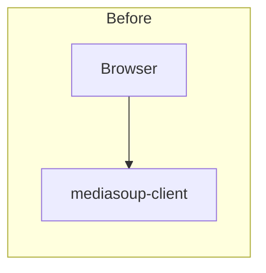

This association is understandable. Most mediasoup applications are web
applications, and browsers already provide complete WebRTC implementations. Over
time, however, this mental model became stronger than the actual architecture.

In reality, `mediasoup-client` is not designed as a browser-only library. It is
a library whose only platform-dependent component are their
**HandlerInterface**s, responsible for translating mediasoup operations into the
native WebRTC APIs provided by the underlying runtime.

React Native demonstrated this years ago by implementing its own handler,
already included with `mediasoup-client`. Node.js, on the other hand, simply
lacked one.

Once that missing pieces exists, the picture changes completely:

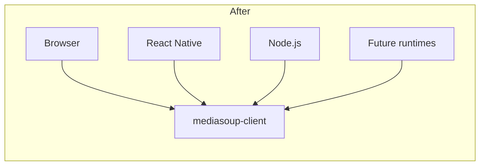

The browser is no longer the architecture. It becomes one possible runtime among
several.

This shift is subtle, but important.

It means that the application logic built on top of `mediasoup-client` can
potentially be reused across browsers, Node.js services, automated tests and
other execution environments, provided that each runtime supplies a compatible
handler.

That is precisely the role of `mediasoup-client-wrtc`.

### The Missing mediasoup Endpoint

At this point it is useful to distinguish between two different layers that are
often confused.

Most videoconferencing applications expose concepts such as:

- Rooms
- Participants
- Calls
- Meetings
- Sessions

Those concepts belong to the application.

Mediasoup intentionally exposes lower-level media primitives instead:

- Workers
- Routers
- WebRtcTransports
- Producers
- Consumers
- DataProducers
- DataConsumers

This distinction is one of mediasoup's greatest strengths.

Rather than imposing a particular conferencing model, it provides flexible
building blocks upon which applications define their own semantics.

The same distinction also applies to clients: a browser application usually
wraps `mediasoup-client` inside higher-level abstractions such as "join room",
"publish camera" or "mute microphone".

Node.js applications should be able to do exactly the same. Not because Node.js
needs browser features, but because it should be able to participate in the same
media architecture using exactly the same abstractions.

In other words, the goal is not simply to just exchange RTP packets, it's to
become another mediasoup endpoint.

## Why This Is Not Already Trivial

At first glance, the problem may appear deceptively simple: Node.js already has
WebRTC implementations, and `mediasoup-client` already exists. Why not simply
instantiate a `RTCPeerConnection` and connect everything together?

The reality is considerably more complex.

`mediasoup-client` is deliberately designed around a platform abstraction known
as `HandlerInterface`, where each supported platform provides its own
implementation responsible for translating mediasoup operations into native
WebRTC primitives. That handler is responsible for much more than exposing a
`RTCPeerConnection`, and It manages capability discovery, SDP negotiation,
transport creation, RTP parameter translation, SCTP negotiation, transceiver
lifecycle, statistics, ICE restarts and numerous platform-specific details that
allow `mediasoup-client` to present a consistent programming model independently
of the underlying runtime. Without that layer, every Node.js project would need
to solve those problems independently.

There is another reason why this gap remained relatively unexplored: server-side
integrations traditionally rely on RTP transports, FFmpeg, GStreamer or similar
pipelines. Those solutions are excellent whenever the goal is media ingestion,
recording or transcoding, but they are considerably less suitable when the
objective is to create a **real mediasoup participant** capable of exercising
exactly the same logic implemented by browser clients, because they by-pass all
the WebRTC media negotiation lifecycle logic.

Automated integration tests are a perfect example: testing the complete
lifecycle of producers, consumers, transports, DataChannels and media
negotiation requires speaking the same language as browser clients. That
language is `mediasoup-client`.

## High-Level Architecture

The project intentionally keeps the public API extremely small: just a WebRTC
runtime is injected into the handler, which in turn is passed to
`mediasoup-client` as its platform implementation.

```ts
import * as wrtc from "@roamhq/wrtc";

import { Device } from "mediasoup-client";
import { WrtcHandler } from "mediasoup-client-wrtc";

const handlerFactory = WrtcHandler.createFactory(wrtc);

const device = new Device({
  handlerFactory,
});

await device.load({
  routerRtpCapabilities,
});
```

This small code snippet hides a surprisingly large codebase, because internally,
the handler bridges two fundamentally different models:

- mediasoup's transport-oriented abstractions.
- the native WebRTC implementation exposed by the selected runtime.

The concrete WebRTC runtime is injected into the handler rather than imported by
the library. The handler depends on a WebRTC contract, not on a specific
implementation.

The complete architecture is illustrated below:

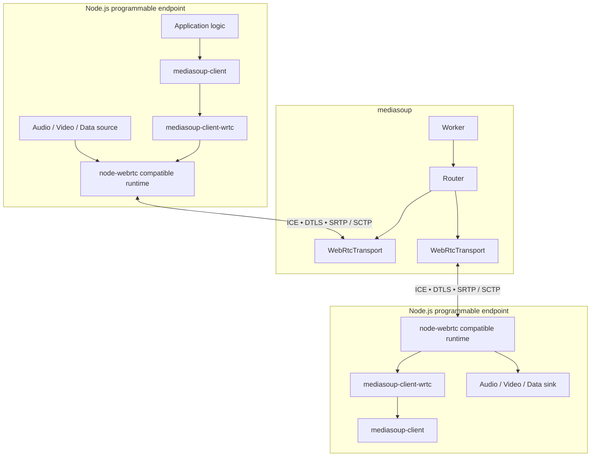

Notice that the application-level concepts intentionally do not appear anywhere
in this diagram. There are no rooms, participants or meetings. Those belong to
the application. The diagram only contains mediasoup primitives.

This separation is one of the reasons mediasoup remains such a flexible
foundation for building realtime systems (not talking about its beastly
performance).

## Headless Browser vs Headless mediasoup Endpoint

When discussing automated testing of frontend libraries, browser automation is
often the first solution that comes to mind. Headless browsers are incredibly
valuable tools, but they solve a different problem: they are heavyweight
end-2-end solutions.

`mediasoup-client-wrtc`, on the other hand, creates programmable mediasoup
endpoints that _could_ be used as a lightweight alternative for automated
testing.

| Headless browser            | Headless mediasoup endpoint          |
| --------------------------- | ------------------------------------ |
| Browser automation          | Native Node.js process               |
| Requires a DOM              | No DOM required                      |
| UI-oriented                 | Media-oriented                       |
| Heavyweight runtime         | Lightweight Node.js application      |
| Validates browser behaviour | Validates WebRTC and media behaviour |
| Full browser startup        | Regular Node.js process              |

This distinction has interesting architectural consequences: because the media
logic no longer depends on rendering or browser-specific APIs, it naturally
encourages a cleaner separation between transport logic and user interface.

The same signaling code, transport management and media lifecycle can now be
reused across browsers, Node.js services and automated integration tests, while
the UI remains free to focus exclusively on presentation.

This is not intended to replace browser testing. Browser-specific behaviour,
permissions, rendering and DOM interactions still require browser automation.

Instead, it introduces an intermediate testing layer capable of exercising the
complete mediasoup media lifecycle without requiring an actual browser.

Perhaps more importantly, it also encourages a healthier software architecture:

> If your mediasoup client logic can only run inside a rendered browser page,
> your media architecture may be coupled too tightly to the UI.

Separating media orchestration from presentation improves reusability,
testability, debugging and long-term maintainability, regardless of whether the
final application runs inside a browser or not.

## Handler Architecture

Creating a `Device` only requires injecting a compatible WebRTC runtime and
passing the resulting `handlerFactory` to `mediasoup-client`. The simplicity of
this API hides a surprisingly complex implementation.

Unlike a browser, where `mediasoup-client` can rely on native platform
integration, Node.js requires the handler to implement the complete contract
expected by `HandlerInterface`. This means acting as the bridge between
mediasoup's transport model and the WebRTC primitives exposed by the selected
runtime.

Internally, the handler is responsible for tasks such as:

- discovering the runtime's native RTP capabilities;
- creating and managing `RTCPeerConnection` instances;
- negotiating ICE, DTLS and SCTP sessions;
- translating mediasoup RTP parameters into SDP;
- managing transceivers and MIDs;
- creating Producers and Consumers;
- creating DataProducers and DataConsumers;
- handling ICE restarts;
- replacing tracks;
- updating RTP encodings;
- exposing sender and receiver statistics.

The objective is not to expose another WebRTC API. Instead, it allows existing
`mediasoup-client` code to execute unchanged inside a Node.js process.

## Bridging Two Different Models

One of the most interesting aspects of the implementation is that it does
**not** simply wrap `RTCPeerConnection`. Instead, it continuously translates
between two different programming models.

On one side, `mediasoup-client` operates with concepts such as:

- RTP capabilities
- Transport options
- RTP parameters
- SCTP parameters
- Producers
- Consumers
- DataProducers
- DataConsumers

On the other side, the WebRTC runtime understands a completely different set of
abstractions:

- `RTCPeerConnection`
- SDP offers and answers
- `RTCRtpTransceiver`
- `RTCRtpSender`
- `RTCRtpReceiver`
- `MediaStreamTrack`
- [RTCDataChannel](https://developer.mozilla.org/en-US/docs/Web/API/RTCDataChannel)

The handler continuously translates between both worlds:

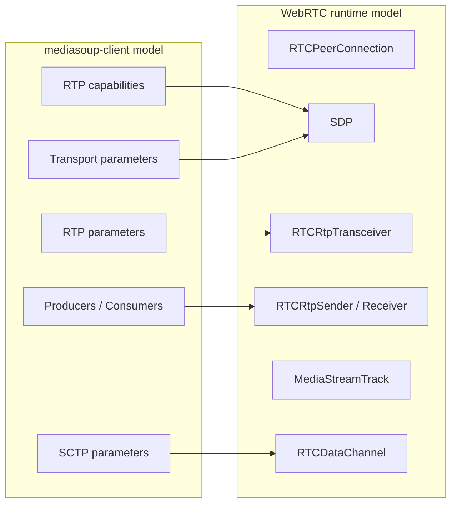

This translation layer is the actual value provided by `mediasoup-client-wrtc`.
Everything else is simply an implementation detail.

## Discovering Native RTP Capabilities

Before a mediasoup `Device` can be loaded, it needs to know which codecs, RTP
header extensions and media capabilities are supported by the underlying WebRTC
implementation. Browsers already know how to obtain this information through
their native handlers. Node.js does not.

Instead of maintaining a static list of supported codecs, the handler queries
the runtime directly by creating a temporary `RTCPeerConnection`, adding
transceivers and generating a local SDP offer. The resulting SDP is then parsed
to build mediasoup's native RTP capabilities:

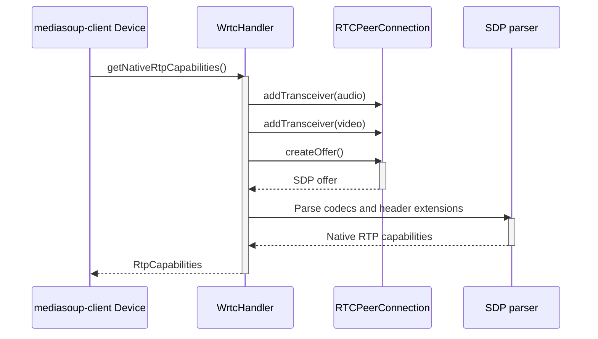

This approach has an important advantage: the handler does not need to know
anything about supported codecs in advance. Instead, it simply asks the runtime.
This makes the implementation naturally compatible with different
`node-webrtc`-compatible runtimes, regardless of the specific libwebrtc version
they are built upon.

## Translating mediasoup Parameters into WebRTC

The opposite operation happens every time mediasoup creates a transport.

Mediasoup exposes transport information using its own data structures:

- ICE parameters
- ICE candidates
- DTLS parameters
- RTP parameters

The WebRTC runtime, however, expects an SDP description.

The handler is therefore responsible for building an SDP representation from
mediasoup's transport model before applying it to the underlying
`RTCPeerConnection`:

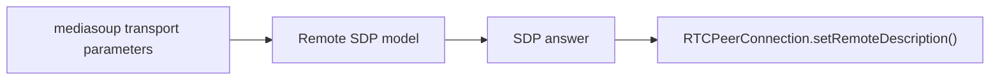

This translation happens transparently for the application.

From the perspective of the developer, though, transports are still created
through the familiar mediasoup APIs.

## Managing Transceivers Throughout Their Lifecycle

Negotiation is only the beginning. Once media starts flowing, the handler must
maintain a persistent mapping between mediasoup entities and the corresponding
WebRTC objects:

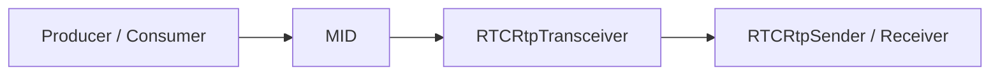

Keeping this mapping alive allows later operations such as:

- pausing Producers;
- resuming Consumers;
- replacing tracks;
- updating encoding parameters;
- gathering sender and receiver statistics;
- stopping transports cleanly.

Without this bookkeeping, the connection could be established, but its lifecycle
could not be managed correctly.

## DataChannels Are First-Class Citizens

Media is not the only transport managed by the handler, SCTP DataChannels are
negotiated through exactly the same infrastructure.

The handler creates the negotiated `RTCDataChannel`, exchanges SCTP parameters
with mediasoup and exposes the resulting `DataProducer` or `DataConsumer`
through the normal `mediasoup-client` APIs:

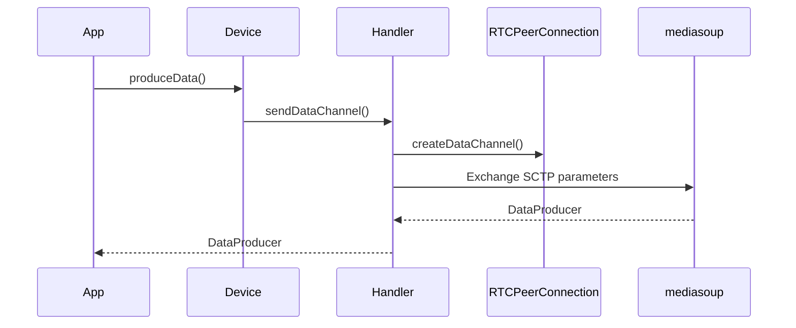

This becomes particularly interesting when combined with server-side
participants: a Node.js process can now participate in exactly the same SCTP
infrastructure as browser clients, opening the door to backend-controlled
DataChannels, service-to-service communication and programmable media workflows.

I previously explored one possible application of this idea in my article
[Mediasoup DataChannels: When Replacing WebSockets Actually Makes Sense](2026-07-08-Mediasoup-DataChannels-When-Replacing-WebSockets-Actually-Makes-Sense.md).
That article itself caused an interesting discussion in the mediasoup Discourse
community forum at
[Mediasoup DataChannels vs WebSockets: An Architectural Experiment](https://mediasoup.discourse.group/t/mediasoup-datachannels-vs-websockets-an-architectural-experiment/6986).
But while that article focused on architectural considerations,
`mediasoup-client-wrtc` provides the missing runtime that makes those
experiments equally possible from Node.js.

## Runtime Injection Instead of Runtime Lock-In

Although the examples in this article use
[@roamhq/wrtc](https://www.npmjs.com/package/@roamhq/wrtc), the project is
intentionally **not** tied to a specific implementation. Instead, the runtime is
injected through a small factory:

```ts
const handlerFactory = WrtcHandler.createFactory(wrtc);
```

This decision may appear minor, but it has important architectural consequences:
rather than depending on one package, the handler depends on a **WebRTC
contract**.

The runtime itself is intentionally injected instead of hardcoded. Although the
examples currently use
[@roamhq/wrtc](https://www.npmjs.com/package/@roamhq/wrtc), the project targets
the API family originally established by
[node-webrtc](https://github.com/node-webrtc/node-webrtc) and
[its compatible forks](https://github.com/node-webrtc/node-webrtc/forks),
allowing different implementations to be substituted without changing the
handler itself.

This design keeps the project independent from any particular runtime while
allowing consumers to select whichever implementation best fits their platform:

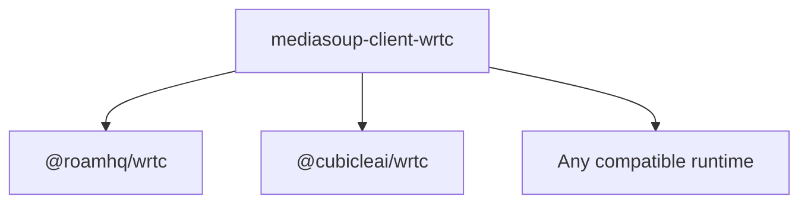

The handler depends on a WebRTC contract, not on a particular implementation.
This design keeps the project flexible while avoiding unnecessary coupling with
any single runtime.

## Public API

The public API intentionally remains extremely small, it requires little more
than injecting the desired runtime:

```ts
import { WrtcHandler } from "mediasoup-client-wrtc";

const handlerFactory = WrtcHandler.createFactory(wrtc);
```

For automated testing, the project also exposes a separate `testing` entrypoint
containing reusable helpers for creating synthetic media sources and inspecting
received media without cluttering the main API surface:

```ts
import {
  createSyntheticAudioTrack,
  createAudioSink,
  createWrtcDevice,
} from "mediasoup-client-wrtc/testing";
```

Keeping the testing utilities isolated from the handler itself makes the core
library remain focused while providing practical building blocks for integration
tests and examples. Due to that, I'm also thinking on moving them out to their
own `mediasoup-client-wrtc-helpers` package.

### Why the Public API Is So Small

One of the design goals of the project was to expose the smallest possible API
surface. Most of the complexity belongs inside the handler, not in user code.

From the application's perspective, the resulting programming model remains
identical to every other mediasoup client. There are no new abstractions to
learn.

- No custom transport layer.
- No proprietary signaling protocol.
- No mediasoup-specific wrapper replacing `Device`.

Instead, existing mediasoup applications simply gain a new execution
environment.

The browser is no longer the only place where `mediasoup-client` can run.
Node.js becomes another first-class runtime.

## End-to-End Media, Not Just API Compatibility

Successfully constructing a `Device` proves that the handler can expose RTP
capabilities to `mediasoup-client`.

It does not yet prove that media can travel through a complete WebRTC pipeline.

A useful Node.js endpoint must be able to do much more:

1. create a `mediasoup-client` Device;
2. negotiate a sending `WebRtcTransport`;
3. produce a real `MediaStreamTrack`;
4. transmit encoded media over ICE, DTLS and SRTP;
5. route that media through mediasoup;
6. negotiate a receiving transport;
7. create a Consumer;
8. receive and decode the media through another WebRTC endpoint;
9. expose the resulting frames to application code.

`mediasoup-client-wrtc` includes a complete example exercising that path with
two independent Node.js clients and a real local mediasoup Worker:

```mermaid
flowchart LR

Source["RTCAudioSource"]
Sender["Node.js sender mediasoup-client Device"]
SendTransport["mediasoup WebRtcTransport"]
Router["mediasoup Router"]
RecvTransport["mediasoup WebRtcTransport"]
Receiver["Node.js receiver mediasoup-client Device"]
Sink["RTCAudioSink"]

Source --> Sender
Sender <-->|ICE + DTLS + SRTP| SendTransport
SendTransport --> Router
Router --> RecvTransport
RecvTransport <-->|ICE + DTLS + SRTP| Receiver
Receiver --> Sink
```

The sender creates a synthetic audio track through the non-standard media-source
API exposed by the selected `node-webrtc`-compatible runtime:

```ts
const source = new wrtc.nonstandard.RTCAudioSource();
const track = source.createTrack();
```

That track is passed to the normal `mediasoup-client` transport API:

```ts
const producer = await sendTransport.produce({ track });
```

At the receiving endpoint, the Consumer exposes a regular `MediaStreamTrack`.
The runtime can attach an audio sink to that track and inspect the decoded PCM
frames:

```ts
const sink = new wrtc.nonstandard.RTCAudioSink(consumer.track);

sink.ondata = (frame) => {
  framesReceived++;
};
```

The source and sink APIs are not part of the WebRTC browser standard. They are
extensions shared by the `node-webrtc` family of runtimes, designed precisely
for programmable media generation and inspection.

Everything between them, however, is a real WebRTC pipeline:

```mermaid
flowchart LR
    syntheticPCM["Synthetic PCM"]

    subgraph libWebRTC_sender["libWebRTC"]
        direction LR

        senderTrack["MediaStreamTrack"]
        rtpSender["RTCRtpSender"]
        opusEncoding["Opus encoding"]
        senderSRTP["SRTP"]

        senderTrack --> rtpSender
        rtpSender --> opusEncoding
        opusEncoding --> senderSRTP
    end

    subgraph mediasoup["mediasoup"]
        direction LR

        incomingTransport["WebRtcTransport"]
        producer["Producer"]
        consumer["Consumer"]
        outgoingTransport["WebRtcTransport"]

        incomingTransport --> producer
        producer --> consumer
        consumer --> outgoingTransport
    end

    subgraph libWebRTC_receiver["libWebRTC"]
        direction LR

        receiverSRTP["SRTP"]
        opusDecoding["Opus decoding"]
        rtpReceiver["RTCRtpReceiver"]
        receiverTrack["MediaStreamTrack"]

        receiverSRTP --> opusDecoding
        opusDecoding --> rtpReceiver
        rtpReceiver --> receiverTrack
    end

    decodedPCM["Decoded PCM frames"]

    syntheticPCM --> senderTrack
    senderSRTP --> incomingTransport
    outgoingTransport --> receiverSRTP
    receiverTrack --> decodedPCM
```

This distinction matters.

A mocked `RTCPeerConnection` can validate method calls and state transitions. A
mocked mediasoup server can validate signaling orchestration. Neither proves
that media actually survives a complete WebRTC exchange.

The real example exercises:

- native RTP capability detection;
- ICE negotiation;
- DTLS establishment;
- SRTP transmission;
- Opus encoding and decoding;
- mediasoup routing;
- Producer and Consumer creation;
- track delivery;
- decoded audio-frame reception.

The example currently verifies that decoded frames arrive at the destination.
Later in this article, I will describe how this can be extended to validate not
only the presence of media, but also its actual content and quality.

## Node.js as a First-Class mediasoup Participant

Testing was the original motivation for the project, but it is not the boundary
of what the handler enables.

Once Node.js can execute `mediasoup-client` through a real WebRTC runtime, it
can become a programmable participant in any mediasoup-based system:

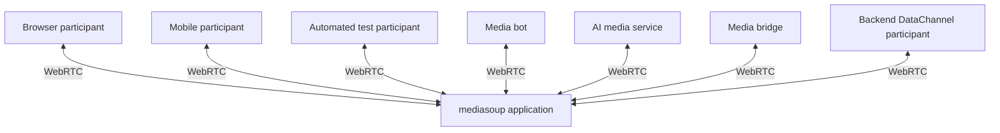

The important word is **participant**.

A Node.js process is not limited to controlling the mediasoup server or
injecting raw RTP into a `PlainTransport`. It can now behave like the client
side of the system:

- loading Router RTP capabilities;
- creating sending and receiving transports;
- producing and consuming tracks;
- opening DataChannels;
- reacting to transport state changes;
- replacing tracks;
- pausing and resuming media;
- collecting sender and receiver statistics;
- restarting ICE when needed.

This makes Node.js suitable for workloads that need the full WebRTC endpoint
lifecycle rather than only access to RTP packets.

It also allows applications to reuse the same client-side abstractions across
multiple environments:

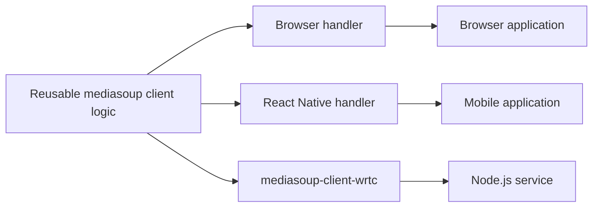

The signaling protocol will still be application-specific.
`mediasoup-client-wrtc` does not attempt to define rooms, participants,
authentication or orchestration.

Instead, it provides the missing low-level endpoint implementation required to
make those higher-level client abstractions reusable in Node.js.

## Integration Testing Without a Browser

A mediasoup server can be thoroughly unit-tested while still failing when
confronted with a real client.

Unit tests are excellent for validating isolated server behavior:

- Router and transport creation;
- Producer and Consumer registries;
- authorization;
- signaling requests;
- state transitions;
- error handling;
- application-level coordination.

But many failures only appear when those components interact with an actual
WebRTC implementation. Examples include:

- invalid or incomplete DTLS parameters;
- mismatched RTP capabilities;
- incorrect codec negotiation;
- broken header-extension mapping;
- Consumer resume errors;
- transport direction mistakes;
- malformed SCTP parameters;
- incorrect lifecycle ordering;
- regressions in ICE restart handling.

A Node.js mediasoup endpoint provides a useful testing layer between server unit
tests and full browser automation:

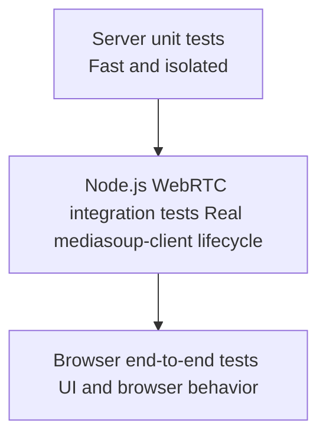

Each layer answers a different question:

| Test layer                       | Main question                                                             |
| -------------------------------- | ------------------------------------------------------------------------- |
| Server unit tests                | Does each server component behave correctly in isolation?                 |
| Node.js WebRTC integration tests | Can a real mediasoup client negotiate and exchange media with the system? |
| Browser end-to-end tests         | Does the complete user-facing application work in a particular browser?   |

`mediasoup-client-wrtc` does not make Playwright, Puppeteer or browser-based
testing (end-to-end tests) obsolete. Instead, it provides a more focused layer
for tests where the subject is the mediasoup and WebRTC behavior rather than the
UI, closer to the integration tests or also acceptance tests layers. A typical
test scenario can create two programmable endpoints:

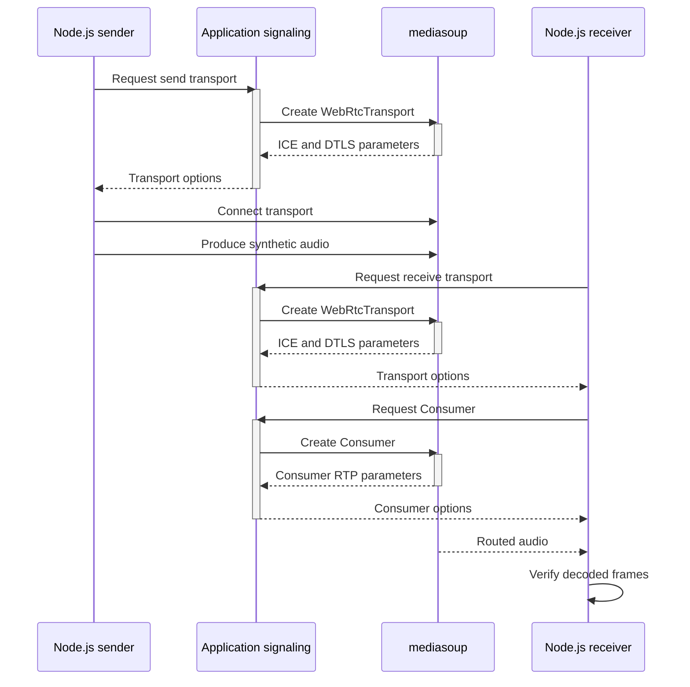

All of this, without needing to access a DOM, nor needing a browser at all.
Also, this can run against:

- a locally running development server;
- a media service inside Docker;
- an ephemeral CI environment;
- a staging deployment;
- a remote integration environment.

Just like integration tests, the test does not need to know how the server
process was started, only that it did. It only needs access to the same
signaling interface used by actual clients.

That separation is desirable: an integration test should validate the externally
observable behavior of the media system, not become coupled to the
implementation details of the server bootstrap process.

At the same time, the ability to run client logic directly in Node.js encourages
a better separation inside the application itself. Signaling, transport
management and media lifecycle code, all of them can live outside DOM components
and be tested independently from rendering. Just remember:

> If your media(soup) client logic can only run inside a rendered browser page,
> your media architecture may be coupled too tightly to the UI.

This does not only improve testing, it improves:

- modularity;
- code reuse;
- debugging;
- observability;
- portability;
- maintainability.

A browser _may_ be one deployment environment for a media(soup) client, but it
**should not** have to define the architecture of the client itself.

## Programmable Media Bots

A media bot is simply a participant whose tracks are controlled by software
instead of a human-operated microphone or camera.

Once Node.js can create and consume mediasoup tracks, many bot-oriented use
cases become straightforward.

### Audio playback bots

A Node.js process can generate or decode PCM audio, push it into an
`RTCAudioSource`, and publish the resulting track as a regular mediasoup
Producer. Possible sources include:

- WAV files;
- generated tones;
- text-to-speech output;
- music;
- announcements;
- prerecorded prompts;
- dynamically generated audio.

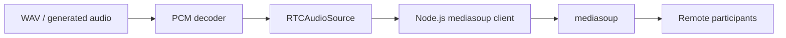

From the perspective of the mediasoup server and the remote Consumers, this is
an ordinary audio Producer. The application does not need a special “bot
transport” or a separate media-delivery mechanism, and it's application
dependent if developer wants to show any difference to the actual users.

### Video generation

The same model applies to video through compatible runtime extensions such as
`RTCVideoSource`. A programmable endpoint can produce:

- synthetic frames;
- generated overlays;
- image sequences;
- rendered dashboards;
- virtual participants;
- [test patterns](https://github.com/piranna/Mediasoup-test-card);
- preprocessed frames from an external pipeline.

### Monitoring and recording bots

A Node.js endpoint can also act as a Consumer. Decoded audio or video can be
inspected, recorded or forwarded to another processing system:

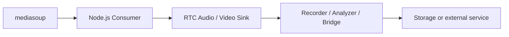

This is not necessarily the most efficient architecture for every recording
system. A `PlainTransport` and direct RTP processing may be preferable when
WebRTC endpoint semantics are unnecessary.

But, the Node.js client approach becomes especially valuable when the bot must
behave like a real participant, share client-side code, exercise WebRTC
negotiation, or interact through both media and DataChannels. That's where the
"lack of especialization" paid off.

## AI Media Services as Real Participants

AI-powered media services are a particularly natural fit for programmable WebRTC
endpoints.

Many current real-time AI architectures need to:

1. receive live audio;
2. decode it to PCM;
3. process it through speech recognition or another model;
4. generate a response;
5. synthesize new audio;
6. publish that audio back into the session.

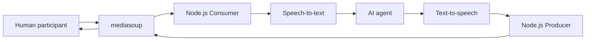

Using a Node.js `mediasoup-client` endpoint allows the AI service to participate
through the same WebRTC model as the other clients. The service can:

- consume selected Producers;
- publish one or more generated tracks;
- pause or resume dynamically;
- replace tracks;
- collect WebRTC statistics;
- exchange metadata through DataChannels;
- react to transport failures;
- reconnect through the same client lifecycle.

This can be useful for:

- conversational voice agents;
- live transcription;
- translation;
- meeting assistants;
- moderation systems;
- audio classification;
- sentiment or event detection;
- real-time media transformation.

Again, raw RTP may be the better choice for some high-throughput processing
pipelines. The advantage here is not that WebRTC should replace every backend
media protocol. The advantage is that a service can become an actual client
whenever endpoint semantics are useful. That distinction gives architects
another option rather than forcing every backend integration through the same
transport model.

## Media Bridges and Processing Pipelines

A programmable Node.js endpoint can also bridge mediasoup with external media
systems.

The outgoing side may consume data from:

- FFmpeg;
- GStreamer;
- a file decoder;
- a hardware source;
- another network transport;
- a custom DSP pipeline.

The incoming side may deliver decoded media to the same kinds of systems.

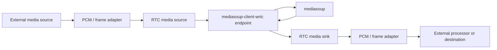

The project intentionally does not implement those adapters. Its responsibility
ends at the runtime's `MediaStreamTrack` boundary.

That is important because media ingestion and processing requirements vary
enormously between applications. By keeping the handler generic, the application
remains free to connect the WebRTC tracks to whichever media pipeline it needs.

## DataChannels From Node.js

Audio and video are only part of the endpoint model.

Because `mediasoup-client-wrtc` also implements SCTP DataChannel support,
Node.js services can create `DataProducer` and `DataConsumer` instances using
the same APIs as browser clients:

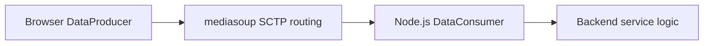

The direction can naturally be reversed:

```mermaid
flowchart LR

Service["Backend service logic"]
Node["Node.js DataProducer"]
MS["mediasoup SCTP routing"]
Browser["Browser DataConsumer"]

Service --> Node --> MS --> Browser
```

This enables backend participants to exchange:

- synchronized metadata;
- control commands;
- telemetry;
- reactions;
- moderation events;
- AI-agent state;
- media-processing results;
- application-specific protocol messages.

Just to be clean: DataChannels should not automatically replace WebSockets. I
explored that trade-off in more detail in
[Mediasoup DataChannels: When Replacing WebSockets Actually Makes Sense](2026-07-08-Mediasoup-DataChannels-When-Replacing-WebSockets-Actually-Makes-Sense.md),
including the additional complexity that appears when SCTP is used as a generic
server-centered messaging layer.

The relevance here is narrower: when a Node.js process already participates in
the mediasoup session, DataChannels become another first-class capability of
that endpoint, and the same Node.js service can consume audio, produce generated
speech and exchange synchronized control data through one coherent client model:

```mermaid
flowchart TB

Node["Node.js programmable endpoint"]
AudioIn["Audio Consumer"]
AudioOut["Audio Producer"]
DataIn["DataConsumer"]
DataOut["DataProducer"]

Node --> AudioIn
Node --> AudioOut

AudioIn --> Processing["Application / AI logic"]
DataIn --> Processing

Processing --> AudioOut
Processing --> DataOut

Node --> DataIn
Node --> DataOut
```

This is particularly useful when data semantics are directly tied to the media
session. For example, an AI transcription service might publish partial
transcripts, word timings, or confidence values through a DataProducer while
consuming the corresponding audio track.

## From Frame Delivery to Deterministic Media Validation

The current real-media example verifies that decoded audio frames arrive at the
receiving endpoint. That is already enough to prove that the complete path is
operational:

```mermaid
flowchart LR
    source["Source"]
    sender["WebRTC sender"]
    mediasoup["mediasoup"]
    receiver["WebRTC receiver"]
    sink["Sink"]

    source --> sender
    sender --> mediasoup
    mediasoup --> receiver
    receiver --> sink
```

But receiving frames does not necessarily mean receiving the **correct** media,
a broken pipeline might still produce frames while introducing:

- severe distortion;
- silence;
- unexpected resampling;
- dropped segments;
- timing errors;
- codec configuration mistakes;
- channel-layout problems;
- corrupted or substituted content.

The logical next step is to validate the information carried by those frames.
This connects directly with my previous work on
[audio-test-fixtures](2026-01-16-Deterministic-Audio-Fixtures-for-End-to-End-Testing.md),
a deterministic, FFT-based methodology for verifying that known audio content
survives lossy and time-sensitive media pipelines through known tone sequences
and spectral analysis. The principle is straightforward:

1. generate a deterministic audio fixture;
2. inject it into the sending WebRTC endpoint;
3. transmit it through mediasoup;
4. capture the decoded PCM at the receiving endpoint;
5. analyze the result;
6. compare it against known spectral expectations.

```mermaid
flowchart LR

Fixture["Deterministic tone fixture"]
Source["RTCAudioSource"]
Sender["Node.js sender"]
MS["mediasoup"]
Receiver["Node.js receiver"]
Sink["RTCAudioSink"]
Capture["Captured PCM"]
FFT["Spectral validation"]
Result{"Pass / Fail"}

Fixture --> Source --> Sender --> MS --> Receiver --> Sink --> Capture --> FFT
FFT --> Result
```

Unlike waveform equality, spectral validation can tolerate many changes that are
normal in real media systems:

- lossy encoding;
- small phase shifts;
- gain changes;
- minor timing drift;
- codec artifacts.

The test can ask a more meaningful question:

> Did the expected audio information survive the complete end-to-end pipeline
> within an acceptable tolerance?

A deterministic fixture could contain a known sequence of tones, for example
across the vocal range. The validator would detect the dominant frequency in
each expected segment and calculate metrics such as:

- detected frequency;
- frequency error;
- percentage of correct tones;
- missing segments;
- signal-to-noise ratio;
- timing deviation.

```mermaid
sequenceDiagram

participant Fixture as Deterministic fixture
participant Sender as Node.js sender
participant MS as mediasoup
participant Receiver as Node.js receiver
participant Validator as Spectral validator

Fixture->>Sender: Known PCM sequence
Sender->>MS: Encoded WebRTC audio
MS->>Receiver: Routed audio
Receiver->>Validator: Decoded PCM frames
Validator->>Validator: Segment and apply FFT
Validator->>Validator: Compare detected frequencies
Validator-->>Receiver: Metrics and pass/fail result
```

This would provide a real content-aware integration test:

- Not only:
  > "Did the Consumer receive frames?"
- But:
  > "Did the correct audio survive encoding, transport, routing and decoding?"

My existing deterministic fixture tooling is currently implemented in Python and
works with WAV files rather than live Node.js tracks. It has not yet been ported
or integrated with `mediasoup-client-wrtc`, and that work remains a future step,
but I'm willing to port it to Typescript and add support for live streams (not
only fixed audio fixtures) if the opportunity arises in a future new contracting
project.

A complete implementation would need to bridge two forms of data, reference WAV
files and live PCM frames, but the principle is straightforward:

```mermaid
flowchart TB

Node["Node.js WebRTC integration"]
LiveSource["Live PCM source"]
Existing["Existing Python tooling"]
LiveSink["Live PCM sink"]

WAVIn["Reference WAV"]
Validator["FFT-based validator"]

Existing --> WAVIn
Existing --> Validator

Node --> LiveSource
Node --> LiveSink

LiveSource -. "adapter required" .-> WAVIn
LiveSink -. "capture / stream adapter required" .-> Validator
```

There are several possible ways to complete that integration:

- port the generator and validator to TypeScript and transpile;
- pre-generate the deterministic WAV fixture and stream it from Node.js;
- capture received PCM to a WAV file and invoke the Python validator;
- expose the validator as a separate process or service;
- implement streaming spectral analysis directly in Node.js.

The final architecture is less important than the testing principle:
`mediasoup-client-wrtc` provides control over both endpoints of the WebRTC
exchange. Deterministic fixtures provide known media content and objective
validation. Together, they would enable repeatable end-to-end tests covering the
complete media path:

```mermaid
flowchart TB

Control["Programmable WebRTC endpoints mediasoup-client-wrtc"]
GroundTruth["Deterministic media fixtures audio-test-fixtures"]
Pipeline["Real mediasoup pipeline"]
Validation["Content-aware validation"]

Control --> Pipeline
GroundTruth --> Pipeline
Pipeline --> Validation
GroundTruth --> Validation
```

This is where programmable endpoints become especially valuable: a browser-based
test can play and record media, but doing so reliably often requires
permissions, virtual devices, browser flags and additional operating-system
configuration. On the other hand, a Node.js endpoint can directly create the
source, inspect the sink and expose every frame to the test harness.

The result is a test environment that is:

- deterministic;
- automatable;
- observable;
- independent from physical devices;
- suitable for CI;
- capable of validating actual media content.

At that point, mediasoup integration testing stops being limited to
control-plane assertions: it can validate the media plane itself.

## Why Release It as Open Source?

`mediasoup-client-wrtc` originated from a practical need: creating real
integration tests for a mediasoup-based service without depending on browser
automation. We wanted to deal with a lot of test cases, and using full browsers
would make them expensive and slow.

The immediate requirement was specific, but the resulting implementation was
not.

The handler contains no product-specific signaling protocol, room model,
authentication mechanism, deployment assumptions or business logic. It does not
know what a meeting, call or participant means to the application using it. Its
responsibility is limited to adapting `mediasoup-client` to a compatible WebRTC
runtime running in Node.js.

That makes it infrastructure.

Keeping such a component private would provide little competitive value while
forcing other teams facing the same problem to rediscover and maintain the same
translation layer independently. The reusable part is precisely the part that
belongs in the open:

- the `HandlerInterface` implementation;
- runtime injection;
- RTP capability discovery;
- SDP and transceiver management;
- sending and receiving media;
- SCTP DataChannel support;
- track lifecycle operations;
- statistics and ICE management;
- synthetic source and sink helpers for testing.

Application-specific signaling remains outside the library, where it belongs.

```mermaid
flowchart TB

subgraph Generic["Generic Open Source infrastructure"]
  Handler["mediasoup-client-wrtc"]
  Runtime["WebRTC runtime adapter"]
  Media["Media and DataChannel lifecycle"]
  Testing["Synthetic testing helpers"]
end

subgraph Application["Application-specific code"]
  Auth["Authentication"]
  Signaling["Signaling protocol"]
  Rooms["Rooms / sessions / participants"]
  Business["Business logic"]
  Deployment["Deployment and operations"]
end

Application --> Handler
Handler --> Runtime
Handler --> Media
Handler --> Testing
```

Publishing the handler as Free Software also provides advantages that go beyond
code reuse. It allows other developers to:

- inspect the implementation;
- validate its assumptions;
- test it with different WebRTC runtimes;
- report compatibility problems;
- contribute missing functionality;
- build integrations that the original use case never anticipated.

That external validation is particularly valuable for a compatibility layer: a
handler can achieve complete coverage against its own tests and still encounter
behaviour differences between runtime implementations, libwebrtc versions,
operating systems or real mediasoup deployments. On the other hand, Open
development increases the number and diversity of environments in which those
assumptions can be exercised.

The project is therefore not Open Source merely because the code happens to be
generic: it is Open Source because openness is part of how a runtime adapter
becomes **trustworthy**.

## Design Philosophy

The project follows a small set of principles.

- Keep the mediasoup-client programming model intact.
- Treat Node.js as a first-class endpoint runtime.
- Inject WebRTC implementations instead of hardcoding one.
- Separate media and transport logic from the UI.
- Keep application signaling outside the library.
- Expose generic testing primitives without turning the core into a test
  framework.

### Preserve the `mediasoup-client` abstraction

As explained in the [High-Level Architecture](#high-level-architecture) section,
the project does not introduce a parallel client API. Applications still create
a `Device`, load Router RTP capabilities, create transports and produce or
consume media using the normal `mediasoup-client` methods.

This matters because the value of the project is not a new abstraction placed on
top of mediasoup. The value is making an existing, mature abstraction available
in another runtime. Code designed around `mediasoup-client` doesn't needs to be
rewritten merely because the endpoint happens to execute in Node.js rather than
a browser.

### Keep runtime dependencies injectable

The handler receives its WebRTC implementation at runtime. It does not import
`@roamhq/wrtc`, `node-webrtc` or another native runtime internally. This
preserves a clean separation:

```mermaid
flowchart LR

Application["Application"]
Client["mediasoup-client"]
Handler["mediasoup-client-wrtc"]
Contract["WebRTC-compatible contract"]
RuntimeA["@roamhq/wrtc"]
RuntimeB["Another node-webrtc fork"]
RuntimeC["Future implementation"]

Application --> Client --> Handler --> Contract

Contract --> RuntimeA
Contract --> RuntimeB
Contract --> RuntimeC
```

The handler depends on the common API contract established by the `node-webrtc`
family, not on one specific package.

This allows the consumer to choose:

- which native module to install;
- which libwebrtc version to depend upon;
- which platforms must be supported;
- which maintenance and release policy is acceptable.

### Separate media orchestration from presentation

A recurring problem in client-side WebRTC applications is the tendency to place
media lifecycle logic directly inside UI components. Transport setup, signaling,
device management, track replacement and Producer state become entangled with
buttons, component state and DOM events.

That coupling makes the application harder to:

- reuse;
- test;
- debug;
- observe;
- migrate;
- or run outside a browser.

The ability to execute the same media logic in Node.js creates useful pressure
to separate those concerns:

```mermaid
flowchart TB

UI["UI / DOM layer"]
Session["Application session logic"]
Signaling["Signaling adapter"]
Media["mediasoup-client lifecycle"]
Handler["Runtime-specific handler"]

UI --> Session
Session --> Signaling
Session --> Media
Media --> Handler
```

The UI may request that a microphone be published or muted, but it should not
need to own the mechanics of transport negotiation.

> If your mediasoup client logic can only run inside a rendered browser page,
> your media architecture may be coupled too tightly to the UI.

A browser may be one deployment environment for a mediasoup client, but it
should not have to be the architecture of the client itself.

Thinking about this concept in advance could be seen in some contexts as
overengineering, but thinking otherwise leads to poor architecture decissions,
and in the long term, to technical debt. Maybe it's just a matter of getting
used to have those concerns on mind when taking architecture decissions.

### Avoid application-level assumptions

Mediasoup intentionally provides low-level media primitives.
`mediasoup-client-wrtc` follows the same philosophy.

It does not define:

- rooms;
- participants;
- calls;
- meetings;
- permissions;
- signaling message formats;
- reconnection policies;
- server topology.

Those concepts vary between applications. A library that attempted to
standardize them would stop being a generic handler and become an opinionated
framework.

Instead, the package gives application code a programmable endpoint from which
those abstractions can be built.

### Keep the core and testing utilities distinct

As explained in [Public API](#public-api), the main package export exposes the
handler, and testing and integration helpers are available through a separate
subpath. This distinction prevents the public handler API from becoming
cluttered with convenience functions while still providing practical tools for
examples and automated tests.

The testing helpers are useful, but they are not the identity of the project;
the handler is. Testing is one of the things it enables.

## Current Limitations

`mediasoup-client-wrtc` already implements a broad portion of the
`mediasoup-client` handler contract, including send and receive transports,
audio and video tracks, DataChannels, track replacement, pause and resume
operations, ICE restarts and statistics. It also includes automated tests and a
real-media example using a local mediasoup Worker and two Node.js endpoints.

It is nevertheless an early project. Understanding its current boundaries is
important.

### Runtime compatibility still needs broader validation

The handler is designed around the API family established by `node-webrtc` and
shared by several compatible forks. That compatibility model is practical, but
structural similarity does not guarantee identical behavior.

Different runtimes may depend on different:

- libwebrtc revisions;
- native build systems;
- operating-system integrations;
- supported architectures;
- non-standard media APIs;
- SDP behavior;
- shutdown semantics.

The examples currently use `@roamhq/wrtc`, but the injection model is
specifically intended to support other compatible implementations. Validating
that portability requires real testing against multiple runtimes.

### Some media APIs are intentionally non-standard

The core WebRTC surface includes familiar APIs such as:

- `RTCPeerConnection`;
- `MediaStream`;
- `MediaStreamTrack`;
- `RTCRtpSender`;
- `RTCRtpReceiver`;
- `RTCDataChannel`.

Programmable media generation and inspection, however, rely on extensions
commonly exposed by the `node-webrtc` family:

- `RTCAudioSource`;
- `RTCAudioSink`;
- `RTCVideoSource`;
- `RTCVideoSink`.

These extensions are extremely useful for bots, tests and media-processing
services, but they are not browser Web standards. The handler itself does not
require all of them merely to create a `Device`. Specific applications and
testing helpers may.

### It does not provide signaling

`mediasoup-client-wrtc` deliberately does not define how a client communicates
with the application server. Every mediasoup application must still implement
signaling for operations such as:

- obtaining Router RTP capabilities;
- creating transports;
- connecting DTLS;
- creating Producers;
- requesting Consumers;
- creating DataProducers and DataConsumers;
- handling application state.

That signaling may use:

- WebSockets;
- HTTP;
- RPC;
- DataChannels after bootstrap;
- a custom protocol.

The library remains independent from that choice. This means that using
`mediasoup-client-wrtc` is not a one-line replacement for a complete application
client. But this is on purposse, since it provides the WebRTC endpoint layer
upon which the application's signaling and session logic operate.

### It does not replace browser testing

A Node.js endpoint executes a real WebRTC implementation, commonly backed by
libwebrtc, but it is not Chromium, Firefox or Safari. It does not validate:

- browser permission prompts;
- device enumeration;
- autoplay policies;
- DOM integration;
- browser-specific WebRTC behavior;
- rendering;
- UI state;
- platform-specific browser regressions.

Those concerns still require browser-based testing.

The project creates a complementary integration layer focused on mediasoup
negotiation and media behavior, but still, that's on purposse.

### It is not always preferable to raw RTP

A full WebRTC endpoint introduces:

- ICE;
- DTLS;
- SRTP;
- SDP negotiation;
- transceivers;
- client lifecycle management.

For recording, transcoding, broadcasting or high-throughput server-side
processing, a `PlainTransport`, FFmpeg, GStreamer or direct RTP integration may
be simpler and more efficient. `mediasoup-client-wrtc` is most useful when the
process needs client semantics:

- the same negotiation path as browser participants;
- a `mediasoup-client` Device;
- WebRTC transport behavior;
- DataChannels;
- reusable client logic;
- realistic integration tests;
- dynamic track lifecycle.

It adds an option to simplify some new use cases, it does not invalidate the
existing ones.

### Deterministic content validation is not implemented yet

The current end-to-end example verifies that decoded frames arrive. It does not
yet validate that their content matches the transmitted signal.

The planned integration with deterministic audio fixtures remains future work,
and probably it would be done in an independent project itself. Until that
exists, the example proves transport and decoding functionality but not spectral
fidelity or media quality.

### It is not yet published on npm

The source is publicly available and can be installed directly from the
repository, but the package has not yet been published to the npm registry.

Publishing it should be straightforward, but the release should include:

- a deliberate initial version;
- validated package exports;
- generated declaration files;
- installation documentation;
- runtime compatibility notes;
- a minimal changelog;
- a clear stability statement.

The project currently has complete automated coverage for its implemented test
surface and relies on APIs that are well known within the `node-webrtc`
ecosystem. That provides a strong basis for an initial public release.

However, code coverage alone does not define API stability. A stable `1.0.0`
release should ideally follow validation across several compatible runtimes and
external integrations. An initial `0.1.0` release would communicate that the
software is usable while leaving room to refine the public contract based on
ecosystem feedback.

## Future Work

The current implementation establishes the essential foundation: Node.js can
execute `mediasoup-client` as a genuine WebRTC endpoint. Several logical next
steps follow from that foundation.

### Publish an initial npm release

The most immediate step is making installation independent from GitHub.

```sh
npm install mediasoup-client-wrtc
```

A registry release would improve:

- discoverability;
- dependency management;
- reproducible installation;
- semantic versioning;
- integration with automated tooling.

The WebRTC runtime should remain a separately installed dependency so
applications retain control over the native implementation they use.

### Validate multiple WebRTC runtimes

Runtime injection only becomes fully valuable when compatibility is verified in
practice.

A useful compatibility matrix could include:

| Runtime              | Platform    | Device loading |       Audio |       Video | DataChannels |
| -------------------- | ----------- | -------------: | ----------: | ----------: | -----------: |
| `@roamhq/wrtc`       | Linux/macOS |              ✓ |           ✓ |     Planned |            ✓ |
| Compatible runtime B | Linux       |    To validate | To validate | To validate |  To validate |
| Compatible runtime C | Other       |    To validate | To validate | To validate |  To validate |

This would identify whether adaptations are needed for differences hidden behind
superficially compatible APIs.

### Expand real-media testing

The current real-server example focuses on audio delivery. Future scenarios
could cover:

- video production and consumption;
- simulcast;
- SVC;
- spatial-layer changes;
- track replacement;
- pause and resume behavior;
- ICE restart;
- network interruptions;
- transport closure;
- multiple Producers and Consumers;
- negotiated DataChannels;
- sustained media exchange.

These should remain integration examples rather than reimplementing a complete
mediasoup application.

### Integrate deterministic audio fixtures

The most compelling testing improvement is content-aware media validation.

```mermaid
flowchart LR

Fixture["Known audio fixture"]
Source["Programmable source"]
Sender["Node.js endpoint"]
MS["mediasoup pipeline"]
Receiver["Node.js endpoint"]
Sink["Decoded PCM"]
Validator["Spectral validator"]

Fixture --> Source --> Sender --> MS --> Receiver --> Sink --> Validator
Fixture -. "Expected spectrum" .-> Validator
```

This could verify:

- frequency preservation;
- missing segments;
- distortion;
- timing drift;
- signal-to-noise ratio;
- regressions caused by codec or transport changes.

The existing
[audio-test-fixtures](2026-01-16-Deterministic-Audio-Fixtures-for-End-to-End-Testing.md)
implementation is written in Python. Integration could initially be achieved
without a full port by:

1. generating or loading a deterministic WAV;
2. streaming its PCM samples into `RTCAudioSource`;
3. capturing decoded PCM through `RTCAudioSink`;
4. writing the result to WAV;
5. invoking the existing validator.

A native TypeScript implementation could follow later if live streaming analysis
or tighter Node.js integration becomes useful.

### Add reusable media adapters

The handler intentionally stops at the `MediaStreamTrack` boundary, but
companion packages or examples could demonstrate adapters for:

- WAV files;
- FFmpeg;
- GStreamer;
- Node.js streams;
- speech-to-text services;
- text-to-speech services;
- hardware sources;
- custom DSP pipelines.

These should remain optional and modular. There is no universal media-pipeline
abstraction that fits every application.

### Explore server-side DataChannel participants

The handler already supports negotiated SCTP DataChannels.

More examples could explore Node.js services acting as:

- telemetry consumers;
- moderation controllers;
- synchronized metadata producers;
- AI-agent coordinators;
- media-processing status publishers;
- server-to-server participants.

This is related to my previous architectural experiment with
[mediasoup DataChannels](Beyond-the-Browser-Running-mediasoup-client-in-Node.js-as-a-Headless-WebRTC-Endpoint.md),
but the objective here is not to replace WebSockets universally. The interesting
case is a Node.js service that already participates in the media session and can
therefore use audio, video and synchronized data through a coherent endpoint
model.

### Improve diagnostics and observability

Programmable endpoints are valuable debugging tools. Future helpers could
expose:

- structured transport-state logs;
- periodic `getStats()` snapshots;
- ICE and DTLS timing;
- packet-loss metrics;
- jitter and round-trip time;
- Producer and Consumer lifecycle traces;
- machine-readable reports for CI.

The existing logger injection already provides a foundation for integrating
diagnostics with an application's logging stack.

### Archive versioned releases

Once the first release is ready, GitHub releases could be archived through
Zenodo. That would provide:

- a permanent DOI for each release;
- a conceptual DOI for the project;
- citable historical versions;
- reproducible references from technical articles.

The project can continue evolving normally. Each archived release would
represent a stable snapshot rather than freezing future development.

## What This Project Changes

The implementation is useful because it fills a concrete technical gap. Its
broader significance comes from the change in perspective it enables.

The traditional mental model is:

```mermaid
flowchart LR
    browser["Browser"]
    client["mediasoup-client"]
    mediasoup["mediasoup"]

    browser --> client
    client --> mediasoup
```

The more general model is:

```mermaid
flowchart LR
    app["Application logic"]
    client["mediasoup-client"]
    handler["Runtime-specific Handler"]
    webrtc["WebRTC implementation"]

    app --> client
    client --> handler
    handler --> webrtc
```

In that architecture, the browser is not the definition of the client. It is one
possible execution environment. Node.js can now become another.

That matters because programmable endpoints make media systems composable:

- A test runner can become a participant.
- A bot can become a participant.
- An AI service can become a participant.
- A media bridge can become a participant.

A backend process can consume a track, analyze it, produce another one and
exchange synchronized state through DataChannels, all through the same
client-side abstractions used by browser applications.

```mermaid
flowchart TB

Client["mediasoup-client"]
Browser["Browser endpoint"]
Mobile["Mobile endpoint"]
Test["Test endpoint"]
Bot["Bot endpoint"]
AI["AI endpoint"]
Bridge["Media bridge"]
Backend["Backend participant"]

Client --> Browser
Client --> Mobile
Client --> Test
Client --> Bot
Client --> AI
Client --> Bridge
Client --> Backend
```

This does not mean that every service should use WebRTC: it means that services
which need WebRTC endpoint semantics no longer have to pretend to be browsers or
bypass `mediasoup-client` entirely.

## Final Thoughts

`mediasoup-client-wrtc` started from a testing problem. The requirement was
simple to state:

> Run real mediasoup integration tests from Node.js without launching a browser.

Solving it required addressing a more fundamental question:

> How can a Node.js process use mediasoup not as the server, but as an actual
> WebRTC participant?

The answer was not another signaling framework, a simulated client or a thin
wrapper around `RTCPeerConnection`: it was a complete `mediasoup-client` handler
capable of translating between mediasoup's client model and a programmable
WebRTC runtime. That translation makes Node.js a first-class execution
environment for `mediasoup-client`.

The immediate benefits include:

- realistic integration tests;
- synthetic media participants;
- programmable bots;
- backend DataChannels;
- AI media services;
- media-processing bridges;
- reusable client logic outside the DOM.

But the most important result is architectural.

> The goal is not to bring mediasoup to Node.js. mediasoup has always run on
> Node.js.
>
> The goal is to bring **mediasoup-client** to Node.js.

The browser is no longer the only execution environment for `mediasoup-client`,
and a headless browser is no longer the only way to create a headless mediasoup
endpoint.

> A browser may be one deployment environment for a mediasoup client, but it
> should not have to be the architecture of the client itself.
>
> If your mediasoup client logic can only run inside a rendered browser page,
> your media architecture may be coupled too tightly to the UI.
>
> The browser is no longer the boundary of a mediasoup application. It is just
> one more endpoint.

Browsers made WebRTC ubiquitous. **Programmable endpoints make it composable.**
