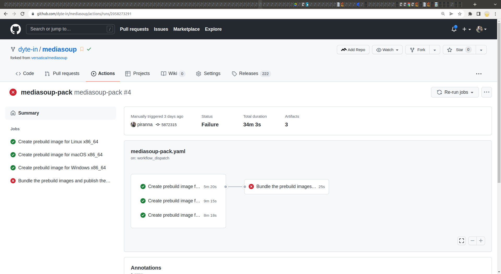

At <https://github.com/versatica/mediasoup/pull/777> (the lucky number :-D) I've
published a PR that allows to create and use prebuild images of `mediasoup`, not
needing to compile it at install on the target platform. This is done by
compiling the Worker executables in advance for multiple platforms, and bundling
them in the distributed package.

Prebuilds are being compiled using
[Github Actions](https://github.com/features/actions). Currently it's being
configured to be able to
[launch the workflow by hand](https://docs.github.com/es/actions/managing-workflow-runs/manually-running-a-workflow),
but also to do it when a new tag with the format `v*` (the same format used by
`npm version` command) is being created. The tag-based dispatch has not been
fully tested, so maybe it needs to be improved on the next release, but it's
just a matter of configuration. Any suggestion on this topic is welcome.

To support the Worker executables for the multiple platforms inside the package,
their location has been changed so their operating system and CPU architecture
is included in their path, similar to how other similar solutions like
[prebuildify](https://github.com/prebuild/prebuildify) works. In fact, I've used
`prebuildify` as inspiration for this PR.

For simplicity, prebuilds are compiled using three different jobs running in
parallel, one for each one of the operating systems supported by Github Actions
(Ubuntu Linux, macOS and Windows), and
[stored as artifacts](https://docs.github.com/en/actions/using-workflows/storing-workflow-data-as-artifacts).
Alternatively I could have been able to use a
[build matrix](https://docs.github.com/en/actions/using-jobs/using-a-build-matrix-for-your-jobs)
so jobs steps are not duplicated, this can be a future improvement. Later, the
artifacts with the Worker executables are being collected and placed in the path
they would be located, if they would have been compiled at install time at their
target platform. Finally, the package is published on
[Github Packages Registry](https://github.com/features/packages) or
[npmjs](https://www.npmjs.com/), depending of the provided credentials.

Currently Github Actions only support `x86_64` CPU architecture, so to compile
for [Apple Silicon M1](https://en.wikipedia.org/wiki/Apple_M1) CPU, we would
need to configure the job compiling for macOS to cross compile to `arm64` and
have multiple builds, or generate an
[universal binary](https://en.wikipedia.org/wiki/Universal_binary). This last
solution is more elegant, but later we would need to support the selection of
the universal binary when searching for the prebuilds, so it would make it more
complex. Cross-compiling to `arm64` is complex too, so until there's support for
[arm64 macOS VMs](https://github.com/actions/virtual-environments/issues/2187)
on Github Actions, only solutions are to have your own self-hosted
[arm64 macOS runner](https://www.mirkogalimberti.com/post/2/github-actions-self-hosted-apple-silicon-m1-runner-howto)
(there are some other recipes to achieve that on internet, too), or compile it
yourself in your local machine and download, update and reload the published
package generated by Github Actions. This last alternative will only works on
[Github Packages Registry](https://github.com/features/packages), since for
security reasons, [npmjs](https://www.npmjs.com/) doesn't allow to publish a
package with the same version number of a previously published one, also if it
has been removed and we want to replace it.

The other half of the solution is the install of the prebuilds in the target
platform. It just only checks what's the platform at install time, and check if
there's a prebuild image for it. If it doesn't exists (like macOS on Apple
Silicon M1, as said before), as a fallback it will compile the package as usual.
Finally, at runtime the package checks again for the running platform, and
search again for a Worker executable for that platform from the available ones,
being this one both a prebuild, or one just ad-hoc compiled at install time.
