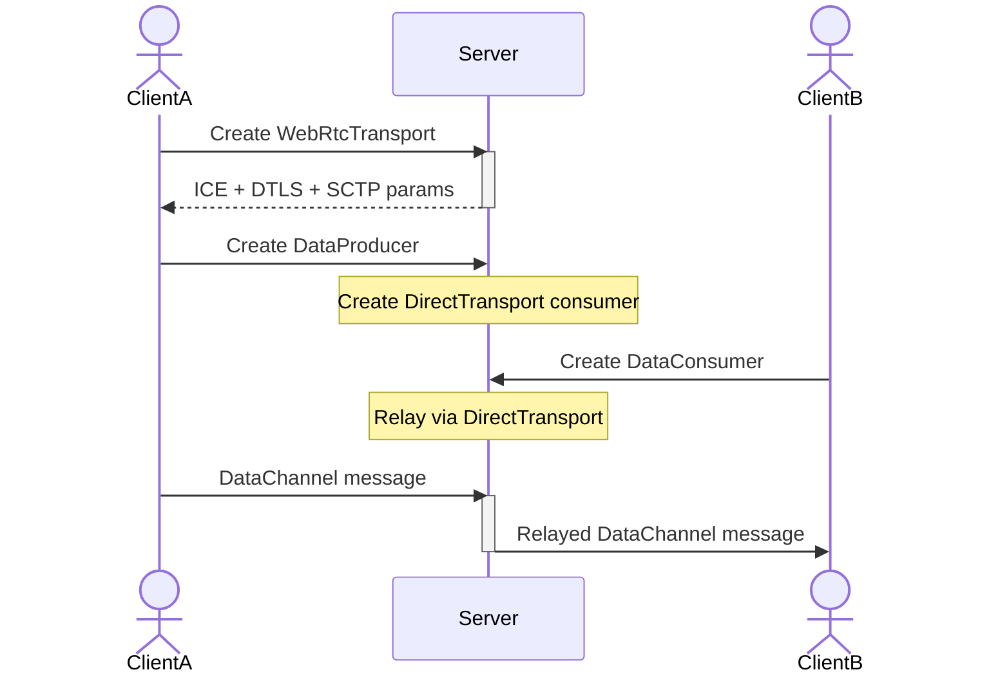

---
categories:
  - Crazy Projects
  - WebRTC
  - Mediasoup
image: 2026-07-08-Mediasoup-DataChannels-When-Replacing-WebSockets-Actually-Makes-Sense.gif
image_alt:
  Your scientists were so preoccupied with whether or not they could that they
  didn't stop to think if they should.
lang: en
layout: post
tags:
  - datachannels
  - websockets
  - real-time
  - software-architecture
title: "Mediasoup DataChannels: When Replacing WebSockets Actually Makes Sense"
---

[](https://doi.org/10.5281/zenodo.20312991)

For years, the _default_ answer for real-time bidirectional communication on the
web has been simple:

- Need a chat? Use [WebSockets](https://en.wikipedia.org/wiki/WebSocket).
- Need signaling? Use WebSockets.
- Need lightweight control messages? Use WebSockets.

And honestly, most of the time, that answer is still correct... although not
necessarily the most optimal (I still find [XMPP](https://xmpp.org/) / Jabber a
pretty robust alternative, and **my** default choice for certain scenarios where
a battle-tested solution with scalability, resilience and chat features matter).

But while working with WebRTC and SFU architectures, I kept running into the
same question:

> If we already have a fully encrypted, low-latency, bidirectional transport
> through
> [WebRTC DataChannels](https://developer.mozilla.org/en-US/docs/Web/API/RTCDataChannel)
> (based on
> [SCTP](https://es.wikipedia.org/wiki/Stream_Control_Transmission_Protocol)
> protocol), why introduce a second parallel communication stack with
> WebSockets?

<!--more-->

To be honest, this has already been studied in the past in the form of two-stage
signaling (one signaling channel to bootstrap a DataChannel connection, and a
second one using that DataChannel for fully established communication). I have
personally implemented that in production several times in the past: it's
complex, and you need to pay attention to more connection states, but later the
performance and server costs pay-off the effort. But my curiosity was more
related to server-based media applications, so the correct question was
actually:

> What happens if we extend that idea to Mediasoup
> [DataProducers](https://mediasoup.org/documentation/v3/mediasoup/api/#DataProducer)
> and
> [DataConsumers](https://mediasoup.org/documentation/v3/mediasoup/api/#DataConsumer),
> as a full replacement for WebSockets in a more generic way?

Mediasoup already support SCTP connections, although they are underused (the
same as WebRTC DataChannels in general...), but functionality is there, so it
could be possible to use its routing mechanisms to build a high-performant and
customizable messages exchange server, both for direct passing messages between
one-to-one connections as I already did in my
[Schuko](https://github.com/piranna/Schuko) project, or in a
[publish-subscribe pattern](https://en.wikipedia.org/wiki/Publish%E2%80%93subscribe_pattern).

That led me to build a small proof of concept, and the result is
[Mediasoup-chat](https://github.com/piranna/Mediasoup-chat), a small but
surprisingly deep experiment exploring how far Mediasoup-based DataChannels
communications can realistically go beyond their usual role as auxiliary
media-session channels.

The short answer:

> Yes, it works.
>
> No, you probably should not use it for generic chat applications (D-oh!).
>
> Yes, it can make a lot of sense in certain media-centric architectures... if
> you can properly identify them.
>
> And the reasons why they can make sense are **much more** interesting than
> expected.

## The Experiment

The project implements a minimal browser chat application using:

- Node.js
- Fastify
- Mediasoup
- WebRTC SCTP DataChannels
- REST-based first-step signaling
- Vanilla JavaScript client

Using WebRTC DataChannels (and a SCTP transport layer) means:

- DTLS encryption
- ICE negotiation
- SCTP stream management
- transport lifecycle
- producer/consumer orchestration

And all are delegated to the Mediasoup infrastructure.

Unlike a traditional chat server based on WebSockets, messages are not exchanged
at application-level but instead that's done entirely through WebRTC
DataChannels routing managed by Mediasoup itself. You could argue that having a
REST-based signaling layer defeats the purpose of the experiment (XMPP
[already uses that](https://xmpp.org/extensions/xep-0124.html) since more than
20 years ago, anyway), and it's true, but that's only used for the first of the
two-stages signaling mechanism, not for the full negotiation. More on that
later.

The idea was not to create a production-ready chat server. The real goal was
understanding:

- how Mediasoup DataProducer/DataConsumer actually behave, and why is so misused
- what architectural complexity appears when using them for generic messaging,
  instead of more traditional methods
- where this approach breaks down
- and, more importantly, after that sad revelations, where it unexpectedly
  starts making sense again

## Why This Is Interesting

At first glance, using Mediasoup for chat sounds like overengineering. And in
many situations, it absolutely is.

A WebSocket server gives you:

- a single persistent TCP connection
- simple request/response semantics
- straightforward broadcast models
- mature tooling
- lower operational complexity

Meanwhile, WebRTC DataChannels require:

- (additional) signaling
- ICE negotiation
- DTLS setup
- SCTP transport configuration
- transport lifecycle management
- producer/consumer orchestration

So for starter, the initial connection delay is longer, and although that
requirements can be abstracted on the high level WebRTC APIs, why even try?

Simple: because once you're already inside a Mediasoup-based architecture,
especially in real-time media systems, that requirements are also needed by the
media part, so you already have them for free, and the trade-offs start
changing.

Suddenly, using the same infrastructure for:

- audio
- video
- metadata
- reactions
- signaling
- control events
- synchronized overlays
- room state
- distributed coordination

becomes surprisingly attractive.

Not because it's simpler. But because it's operationally and from an
architecture PoV coherent.

## The Core Architecture

The PoC uses a surprisingly elegant relay mechanism built around Mediasoup
DirectTransports: instead of implementing a custom application-level routing
layer, the server internally relays DataChannels through Mediasoup itself. The
architecture looks roughly like this:



Messages flow through:

```text
Client A
  → WebRtcTransport DataProducer
  → DirectTransport Consumer
  → DirectTransport Producer
  → Client B DataConsumer
```

This approach has some surprisingly nice properties.

### Advantages

#### Unified Infrastructure

Everything flows through Mediasoup:

- media
- control events
- metadata
- synchronization signals

That means:

- one transport model
- one observability layer
- one scaling model
- one operational stack

And no need to decode and parse messages to know where they need to be routed.

#### Native WebRTC Properties

DataChannels automatically inherit:

- DTLS encryption
- congestion control
- NAT traversal
- SCTP reliability modes
- low-latency UDP transport

without introducing additional protocols.

#### Tight Coupling With Media Sessions

This becomes especially interesting for applications where the data is
semantically tied to media streams. For example:

- synchronized reactions during livestreams
- moderation commands
- stage requests
- collaborative whiteboards
- timed metadata overlays
- [Kahoot!](https://kahoot.com/)-like live quizzes
- stream telemetry
- distributed SFU coordination

In these scenarios, keeping everything inside the same Mediasoup session context
can actually simplify the overall system, and more specially if we additionally
plan to record and track all the media and the participants interactions in a
single session, so we don't need to listen and process data from several
sources.

## The Real Complexity Appears Elsewhere

The most interesting lesson from the project was not that DataChannels work,
that was expected.

The interesting part is discovering all the hidden infrastructure that
WebSockets solve _implicitly_.

### Signaling Never Disappears

One of the most important realizations is:

> WebRTC DataChannels cannot bootstrap themselves.

You still need an external signaling channel... or maybe some interesting
experiment to bootstrap with single HTTP requests alike to how
[WHEP](https://www.ietf.org/archive/id/draft-murillo-whep-03.html) protocol is
used to access to server-based WebRTC media 🤔.

(I already implemented something like that a couple of times in production
environments for some big clients like [Fermax](https://www.fermax.com/),
[Prosegur](https://www.prosegur.es/) and [TRC](https://trc.es/), but that's a
story for another time.)

In this PoC, REST endpoints handle:

- transport creation
- DTLS negotiation
- producer creation
- consumer subscription
- session coordination

Which means that even after replacing WebSockets, you still end up needing for
orchestration:

- REST
- SSE
- long polling
- WebSockets
- or a second-stage control DataChannel

At that point, the architecture starts asking difficult questions: if you still
need signaling infrastructure anyway, are you really simplifying anything?

Usually, the answer is no.

### Double Transport Overhead

Unlike a typical WebSocket connection, the browser needs:

- one SendTransport
- one RecvTransport

just to achieve basic bidirectional communication. Although they can be unified
in a single WebRTC RTCPeerConnection instance, that means:

- more ICE negotiation
- more DTLS handshakes
- more SCTP state
- more memory usage
- more lifecycle management

For just a normal chat application, this is obviously inefficient.

### O(N×M) Scaling Problems

The relay architecture usually used on media retransmission makes sense because
communication can be considered mostly unidirectional / one-to-many, and the
number of producers and consumers are constant and known in advance and usually
doesn't change (at most, only change the number of consumers). This has the
advantage that there's no handling of data on the server side for the routing
part: It receives data in, and write it back out.

In contrast, to send messages between multiple WebSockets, typically it's used a
router architecture to act as a postman. In this scenario, if receivers are not
just a few and known in advance, the relay architecture also introduces another
interesting issue; every producer potentially needs:

- multiple consumers
- multiple DirectTransports
- subscription coordination
- server-side state tracking

As the number of clients grows, complexity scales exponentially, because we
would need a dedicated channel to send the data to another receiver. Think of it
as your group of friends having a
[tin-can phone](https://en.wikipedia.org/wiki/Tin-can_telephone) for each other,
each new member needs a new line for each one of the previous members.

This is very different from the implicit broadcast semantics most WebSocket
infrastructures implement by default, where all your friends are just hanging
out and speaking in the same room... although this can also be implemented with
Mediasoup, but to don't complex things, because there's no parsing of the
messages on server side, you would receive back your own messages, since server
will not be able to filter you out when broadcasting them.

Again:

> technically feasible does not necessarily mean architecturally reasonable.

Or said in another way (that could be considered a personal mantra of mine, both
in the good and the bad way):


## But Here Is Where Things Get Interesting

After building the project, I ended up reaching a conclusion that surprised me:

- Using Mediasoup DataChannels for generic messaging is mostly an anti-pattern.
- But using them inside already-existing media infrastructures can actually make
  a lot of sense.

Especially when:

- the application already depends heavily on Mediasoup
- data semantics are tightly coupled to media semantics
- synchronization matters
- operational consistency matters more than raw simplicity

This becomes even more relevant in:

- livestreaming platforms
- collaborative media applications
- distributed SFU systems (like [Mafalda SFU](https://mafalda.io))
- edge media architectures
- multi-node real-time systems

At that point, introducing an entirely separate WebSocket infrastructure,
although it's still obviously the default way-to-go solution, it starts looking
less obviously correct.

## The Most Important Architectural Insight

The biggest lesson from this experiment is probably this:

> DataChannels are not a better WebSocket (at least for server-centered
> architectures).

They are something else entirely.

WebSockets optimize:

- simplicity
- application messaging
- server coordination
- generic bidirectional communication

Meanwhile, Mediasoup DataChannels optimize:

- media-adjacent synchronization
- transport unification
- session coupling
- low-level real-time infrastructure integration
- P2P and server-to-server direct communications

Maybe that last bullet has the key: WebRTC technologies were not designed with
client-server use cases in mind, although they are being used a lot for that.
Trying to compare them directly misses the point.

## Why The PoC Matters Anyway

Even if the conclusion is ultimately:

> “You probably should keep using WebSockets.”

this project still revealed several interesting things:

- how Mediasoup internally models SCTP transports
- how DirectTransports can be repurposed as relay infrastructure
- how signaling complexity emerges naturally in WebRTC systems
- where operational consistency can outweigh protocol simplicity
- how media systems start behaving differently once everything shares the same
  transport model

And honestly, these are exactly the kinds of experiments that make working with
cutting edge technology and real-time systems interesting 😄

Sometimes the value is not proving that an architecture or a system is
universally correct. Sometimes the value is discovering precisely where it stops
being reasonable.

## Future Directions

Several follow-up directions emerged while building the PoC.

### TypeScript Migration

The current implementation intentionally uses plain JavaScript to keep the
experiment lightweight. But a TypeScript version would significantly improve:

- signaling contracts
- transport lifecycle typing
- producer/consumer registries
- large-scale refactorability

### Bundled Client Artifacts

The client currently imports
[mediasoup-client](https://www.npmjs.com/package/mediasoup-client) from a CDN
for simplicity. A more production-oriented version would:

- bundle client artifacts
- pin dependency versions
- optimize caching
- remove external runtime dependencies

### Server-to-Server DataChannel Architectures

This is probably the most interesting unexplored direction. Using DataChannels
for:

- inter-router coordination
- distributed SFU synchronization
- dynamic topology propagation
- federation metadata

starts looking far more compelling than browser chat, especially because many of
the browser-related signaling problems disappear entirely in server-to-server
environments. That's one of the reasons I created
[Mediasoup-client-wrtc](https://github.com/piranna/Mediasoup-client-wrtc), so
it's possible to use
[mediasoup-client](https://www.npmjs.com/package/mediasoup-client) APIs from
Node.js server side. I'll write about it shortly in a future post.

## Final Thoughts

This project started as a curiosity, mostly a simple question:

> Can Mediasoup DataChannels replace WebSockets?

The final answer ended up being much more nuanced.

- For generic real-time applications:

  > probably not.

- For tightly integrated media systems:
  > sometimes, surprisingly, yes.

And more importantly,

> the experiment exposed architectural boundaries that are usually hidden behind
> abstractions

which is often where the most interesting engineering lessons live.
