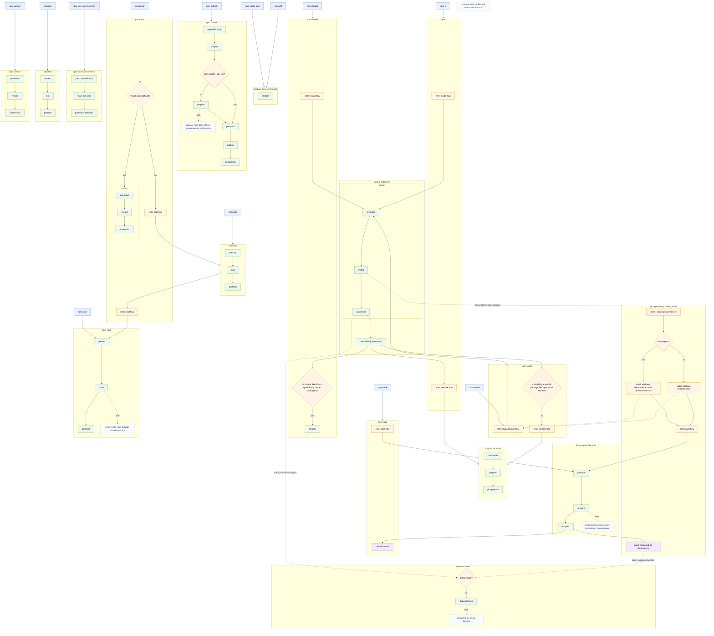
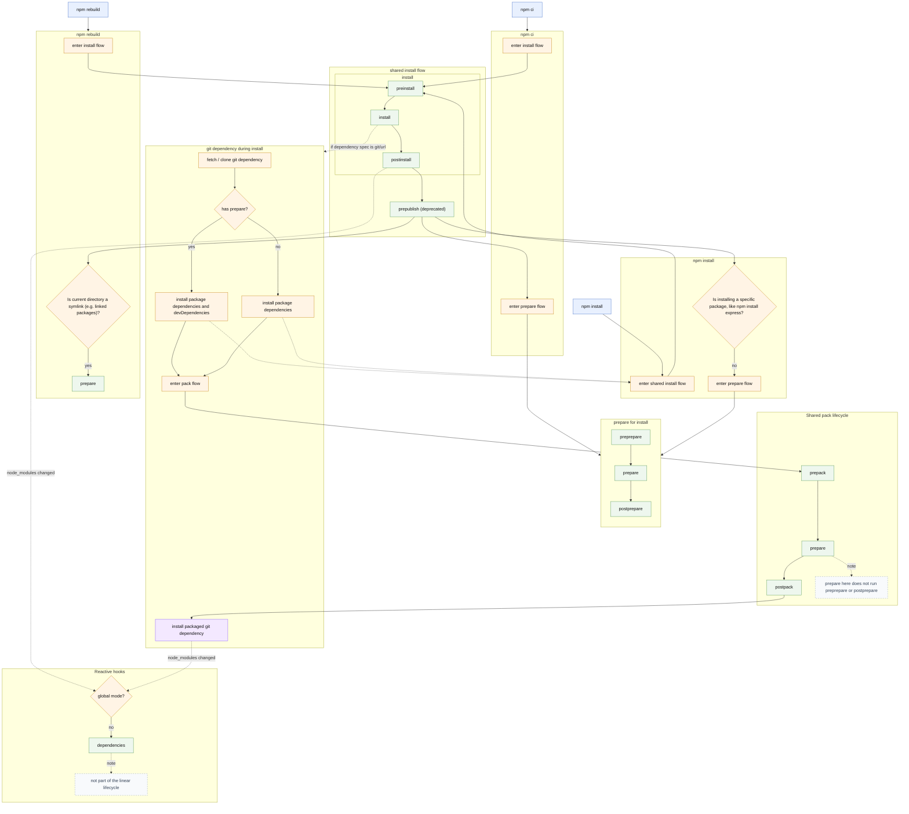
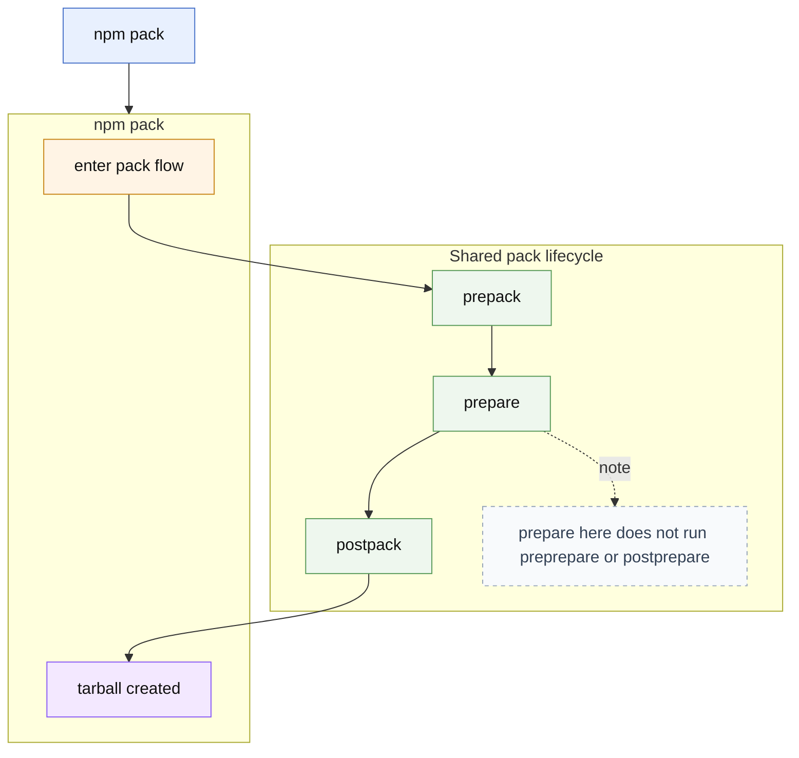
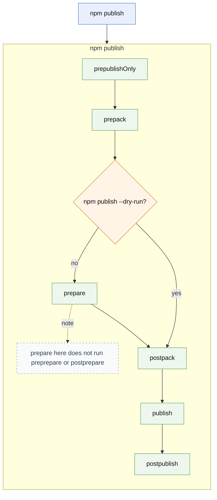
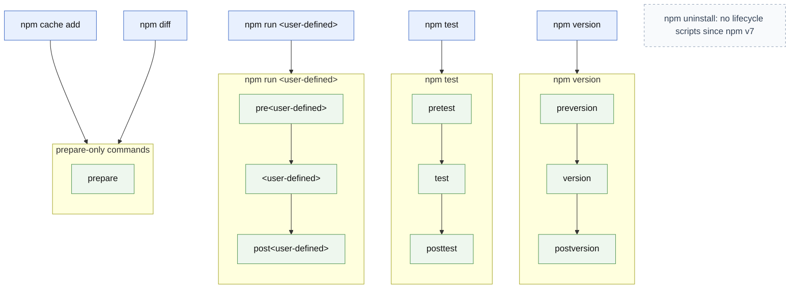
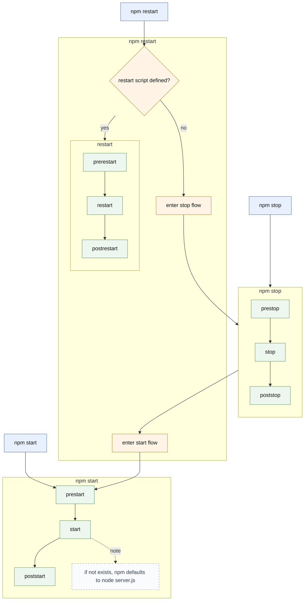

---
categories:
  - JavaScript
  - WebRTC.ventures / AgilityFeat
lang: en
layout: post
tags:
  - npm
  - lifecycle-scripts
  - package-management
  - nodejs
  - build-tools
  - ai-coauthored
title: Understanding npm Lifecycle Scripts (Once and For All)
---

> Or: how a simple question about `prepare` vs `prepublishOnly` turned into a
> full-blown reverse-engineering of [npm](https://www.npmjs.com/).

<!--more-->

_Original version initially published on 14th May 2026 on the
[AgilityFeat blog](https://agilityfeat.com/blog/) as
[Understanding npm Lifecycle Scripts (Once and For All)](https://agilityfeat.com/blog/understanding-npm-lifecycle-scripts/).
This is a reviewed and cleaned version._

## The Problem: npm Scripts That Don’t Mean What You Think

If you’ve worked with npm long enough, you’ve probably had this discussion:

- Should we use `prepare`?
- Or `prepublishOnly`?
- Is `prepublish` deprecated or still relevant?
- Why is `prepare` running during `npm install`?!
- Why does something work locally but break in CI?

I’ve had this exact debate multiple times with teammates. And every time, we
ended up in the same place:

👉 The [npm documentation](https://docs.npmjs.com/cli/v11/using-npm/scripts) is
technically correct… but not cognitively clear.

The issue is not that the docs are wrong. It’s that:

- The lifecycle is described **linearly**, per command (that's ok, it's
  documentation of a CLI tool after all, so it makes sense to structure it as a
  `man` page)
- But in reality,
  [npm lifecycle scripts](https://docs.npmjs.com/cli/v11/using-npm/scripts#life-cycle-scripts)
  behave like a **graph of shared, reusable flows**
- Some scripts are **contextual**…
- …and others are **reactive** (that caught me by surprise)
- And some (looking at you, `prepare`) are **everywhere**, and have different
  surrounding scripts depending on the context they are running or the way they
  are invoked.

This makes it very easy to misunderstand what runs, when, and why.

## The Goal

We wanted to answer a simple question:

> **Which script should we use, and what actually runs under each npm command?**

But instead of stopping at an answer, I went further:

- Look in the npm documentation for common patterns between the different
  workflows in the npm lifecycle scripts, and model them as a
  [graph](#the-result-a-complete-npm-lifecycle-graph)
- Understand how flows are **shared and reused**
- Capture (and learn about) uncommon edge cases like:
  - `npm publish --dry-run`
  - git dependencies
  - `npm rebuild`
  - `npm install <folder>`
  - global installs (currently considered an anti-pattern since several years
    ago, but still worth understanding)
  - reactive hooks like `dependencies`

## The Result: A Complete npm Lifecycle Graph

Below is the final humongous (237 lines) Mermaid diagram:



This is not just a list of scripts, it’s a **system model** of how npm actually
works.

(Yes, it’s a bit overwhelming at first. But it’s worth taking the time to
understand it. Also, [Mermaid](https://mermaid.js.org/) diagrams can became a
bit chaotic when they get too big. I did my best to tidy it up, shame on them.)

## Key Insight: npm Scripts Are Not a Sequence. They’re a Graph

The most important realization is this:

> npm lifecycle scripts are not independent pipelines, they are **composed
> flows**.

Some examples:

- `npm publish` **includes** the `pack` flow
- git dependencies **reuse** the `pack` flow internally
- `prepare` appears in multiple contexts, but **not always with the same
  surrounding scripts**:
  - sometimes with `preprepare` and `postprepare`
  - others with `prepack` and `postpack`
  - and sometimes alone 🤷
- `dependencies` is not part of any flow, it’s a **reactive hook** dispatched
  after changes to the `node_modules` folder (pretty recent addition, by the
  way)

Once you see them as a directed graph instead of a set of independent scripts
chains, everything suddenly becomes much clearer.

## Breaking Down the Flows

To make the full diagram digestible, let’s break it into its main components.

### 1. Install Flow (`npm install` / `npm ci` / `npm rebuild`)

This is the most overloaded part of npm, and complex enough that I honestly
think this flow could be
[Turing-complete](https://en.wikipedia.org/wiki/Turing_completeness) itself. Not
only it's big, but also it's spread across three different commands
(`npm install`, `npm ci`, and `npm rebuild`) with subtle different behaviors for
their particular use cases. The flow has a lot of edge cases and special
contexts (git dependencies, global installs, linked packages, etc), and there's
also the possibility that dependencies dispatch their own lifecycle scripts
recursively.

#### The Full Install Flow



The full lifecycle is:

```txt
preinstall → install → postinstall
→ prepublish
→ preprepare → prepare → postprepare
```

But here’s the catch:

- `prepare` **only runs** in certain cases:
  - local install without arguments (like, directly running `npm install` in the
    package folder, for example a source code git clone)
  - `npm ci` (equivalent to `npm install`, but more strict, intended for
    production or reproducibility scenarios)
  - some linked or special installs

- It does **not** run when installing a specific package, both globally or as a
  dependency, because they are already "published" and ready for production use.
  For example:

  ```sh
  npm install express  # ❌ no prepare
  ```

##### Why this matters

This is one of the biggest sources of confusion and discussion. People assume:

> “prepare runs on install”

But the real rule is:

> “prepare runs depending on how and where `npm install` is invoked”

#### Git Dependencies

Related to the packages install process, this is one of the least understood
parts of npm, although very practical in case you want to work with private
and/or in-development packages without publishing them to a (public) registry,
or when needing to work with forks of dependencies that implement some fixes
that you need until they get merged and published in the upstream package (if
this ends to happens someday).

When installing from git:

- npm **clones the repository**

- If the package has `prepare`:
  - installs `dependencies` + `devDependencies`
- Else:
  - only installs `dependencies`

- Then:
  - runs the pack lifecycle (`prepack → prepare → postpack`)
    - **Note**: `prepare` here does not include `preprepare` or `postprepare`,
      it’s a different context from the one in the install flow, and it’s
      effectively acting as a `pack` script, which is why it runs instead the
      `prepack` and `postpack` scripts. That's the same reason why, if package
      doesn't have a `prepare` script, that fake `pack` script acts instead as a
      no-op by default.
  - installs the generated artifact

So effectively:

> A git dependency is automatically built locally before being installed.

As an old-school open source hacker developer myself, I find it very well
though, and this alone is enough reason for me to make `prepare` a standard part
of my workflow when creating packages that need some preparation before being
used directly from their source code: it left the package in a state equivalent
to a production-ready deployment, so it makes it easier test and debug them in
real-alike environments and configurations during development stage.

#### Reactive Hooks (`dependencies`)

This one is special and somewhat recent, so I didn't know about it before
working on the creation of this graph.

`dependencies` is:

- **Not part of the lifecycle chain**
- Triggered **after changes to `node_modules`**
- Not executed in global mode

Think of it as:

> An event, not a step

### 2. Pack Flow (`npm pack`)



The pack lifecycle is clean and predictable... but naming can be confusing:

```txt
prepack → prepare → postpack
```

Important detail:

> `prepare` here does **NOT** include `preprepare` or `postprepare`

This is a completely different context from `install`. That's the reason why it
executes `prepack` and `postpack`, but not `preprepare` or `postprepare`:
because here `prepare` effectively acts like a `pack` script (by the way, a
script named `pack` is forbidden because it would conflict with the `npm pack`
command. Legacy issues like the `prepublish` one and so).

### 3. Publish Flow (`npm publish`)



The publish lifecycle is:

```txt
prepublishOnly
→ prepack → prepare → postpack
→ publish
→ postpublish
```

With one critical edge case:

> When using `npm publish --dry-run`, `prepare` does **NOT** run.

This is extremely important for CI/CD pipelines, if we want to have a fully
automated workflow to publish new versions and releases of our package.

### 4. Other Lifecycle Commands



These follow consistent patterns, so they are pretty intuitive about their
lifecycle:

- `npm run <name>`: `pre<name> → <name> → post<name>`
- `npm test`: `pretest → test → posttest`
- `npm version`: `preversion → version → postversion`

#### A Special case: `npm start`, `npm stop`, and `npm restart`



`npm restart` is a bit special because it has a conditional flow: if a `restart`
script is defined, it runs the `restart` lifecycle
(`prerestart → restart → postrestart`) the same way as the other commands, but
if it’s not defined, it defaults instead to running the `stop` and `start`
lifecycles sequentially, without running `prerestart` or `postrestart` (because
`restart` is not defined and can't be executed, so those scripts are ignored):

```python
if restart script exists:
  prerestart → restart → postrestart
else:
  prestop → stop → poststop
  → prestart → start → poststart
```

## So… Which Script Should You Use?

After all this, here’s the practical takeaway.

### ❌ Avoid

- `prepublish`
  - deprecated
  - misleading
  - runs on `install`, not `publish`

### ⚠️ Be careful with

- `prepare` is your way to go, but:
  - runs in many contexts
  - easy to misuse
  - can break installs unexpectedly

### ✅ Prefer

- `prepack`
  - for build steps
  - consistent and predictable

- `prepublishOnly`
  - for validation before publishing

### The Mental Model

If you needs to remember only one thing, make it this:

> - `prepublishOnly` validates
> - `prepack` builds
> - `prepare` leaks everywhere, but probably it's the one that you want

## How We Built This Diagram

This wasn’t created in one go.

The process was iterative and surprisingly collaborative with ChatGPT AI:

1. Started from npm documentation
2. Identified inconsistencies and confusion points
3. Modeled initial flows manually
4. Used ChatGPT to:
   - structure flows
   - identify missing cases
   - validate assumptions

5. Refined visually using [Mermaid Live](https://mermaid.live)
6. Reworked the diagram multiple times to:
   - remove duplication
   - unify flows
   - improve readability
   - make it a [graph](#the-result-a-complete-npm-lifecycle-graph), not several
     lists

The key breakthrough was:

> Stop thinking in sequences, start thinking in reusable flows.

## Final Thoughts

`npm` is not broken.

But its lifecycle model is:

- under-explained
- overloaded
- legacy-ridden
- and very easy to misunderstand

Once you see it as a graph, though, it finally clicks, and you can make better
decisions about where to put your logic.

If this helped you, or if you’ve had your own “why is `prepare` running here?”
moment, let me tell you: you’re definitely not alone 🙂

---

> Note: Parts of this work were developed with the assistance of AI tools. All
> opinions, ideas, experiments, validations and conclusions are my own.
