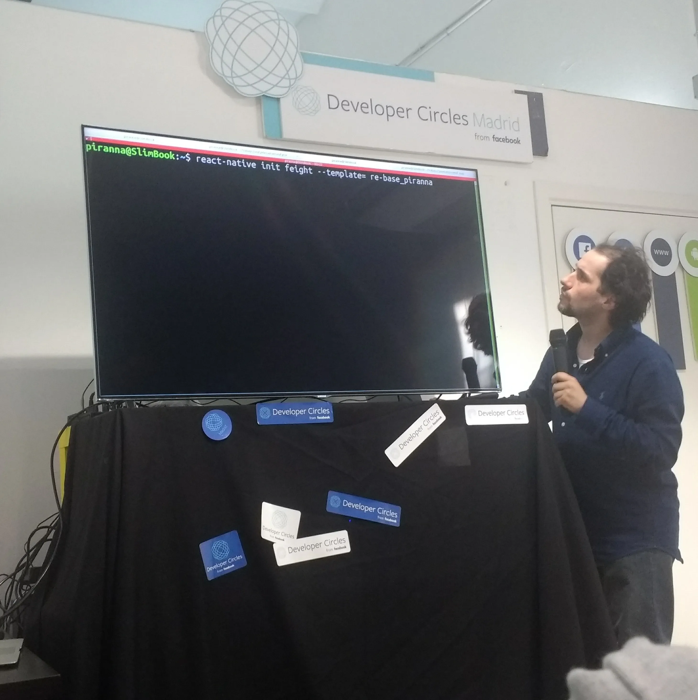

Most important contributions to third-parties Open Source projects

## [browserslist]()

features

## [istanbul-js](https://istanbul.js.org/)

`istanbul-js` is a code coverage tool that's being used internally by
[Jest](https://jestjs.io/) testing framework, developed by Facebook and the
current de-facto standard for Node.js, React and Javascript projects. Its
default text output format was too much limited when showing the number of code
coverage missing lines, so I refactored it to reduce the number of decoration
characters and auto-adjust to the width of the terminal by default, in addition
of [grouping ranges](https://github.com/istanbuljs/istanbuljs/pull/525) of
consecutive missing lines to be able to show more of them.

## [libWebrtc](https://webrtc.googlesource.com/src/)

Google implementation of WebRTC spec, used in Chrome browser and Android,
between others. In this one, I added support for the `removeTrack` event in the
[Java bindings](https://webrtc.googlesource.com/src/+/ffbfba979f9d48176c7ed5dcc60b6a8076303b71),
to allow dynamic removal of video and audio tracks from PeerConnection objects
in Android applications.

This contribution was sponsored by
[Atos Research & Innovation](https://atos.net/en/about-us/innovation-and-research).

## [node.js]()

static builds
test

## [node-canvas](https://github.com/Automattic/node-canvas)

As part of the development of [NodeOS](projects#NodeOS) to provide it some basic
graphic capabilities, I added support for configurable backends on
`node-canvas`, with the intention of being able to draw directly on the Linux
`FbDev` framebuffer device instead of just only in memory, in addition to X11
and Windows GDI (Win32 API). Backends support has been already accepted in
upstream code, while FbDev, X11 and Win32 code are still pending of approval. In
the future, I plan to add support for other graphic systems like accelerated
Linux DRM/KMS or macOS Quartz.

This project was later being sponsored by [Ventrata](https://ventrata.com/) to
add improve FbDev backend adding support for double-buffering, VSync and 24bits
color mode, and easing the path to add new *screen based* backends.

## [node-webrtc](https://github.com/node-webrtc/node-webrtc)

As a WebRTC pioneer since 2012 with [ShareIt!](projects#ShareIt), I've been
contributing to other projects, specially using `node-webrtc` as a building
block for Node.js applications, where I've worked to improve the APIs
compatibility with browsers in addition to maintenance tasks.

## [num2words](https://pypi.org/project/num2words/)

`num2words` is a Python library that provides word captions of numerals for
multiple languages and dialects. As part of my work at
[qvantel](https://qvantel.com/), not only I added support for algerian french
(where numerals are based on increments of 100, instead of increments of 20 as
speaked in France) but also added support for their coins scheme, and refactor
support of generic french language to simplify it and add make it easier to add
support for other dialects like swiss french, that give me some compliments both
from library owner and my superiors for the clean work I did and how much easy
and streamlined it was now to use and improve the library itself.

## [redux-offline](https://github.com/redux-offline/redux-offline)

`redux-offline` provides helper functions to allow to operate with network
requests with [redux](https://redux.js.org/) state container. I have been using
it in almost all my *React Native* projects, and my contributions includes
support for async dispatching to control when failed requests are due to expired
tokens (and being able to re-new them and re-do the request without lossing the
session), or allow to make use of multiple queues of parallel network operations
with different protocols in a single application, without blocks between them.
Thanks to these changes, I've been given administratotive permissions on the
project itself.

You can find more info about `redux-offline` in
[Redux-offline in Node.js](../_posts/2020-02-24-Redux-offline-in-Node.js.md)

## [re-start](https://github.com/react-everywhere/re-start) (AKA *ReactNative Everywhere*)

`re-start` is a wrapper for *React Native* that provides configuration to add
support for `web` platform in addition to standard Android and iOS platforms,
all of them by using a single code base. I added support for Electron and
Windows, thanks to it I got to be administrator of the project, and future plans
include add support for macOS applications, and a rework of the project from
being a *React Native* template to be a CLI tool capable of enable support for
the additional platforms to any other already available *React Native* current
project.

[React Native Spain @ F8 Madrid](https://www.meetup.com/es-ES/react-native-spain/events/250280501/),
Madrid 3th May 2018:

You can find more info about `re-start` in
[What's re-start?](../_posts/2020-04-15-Whats-re-start.md)
