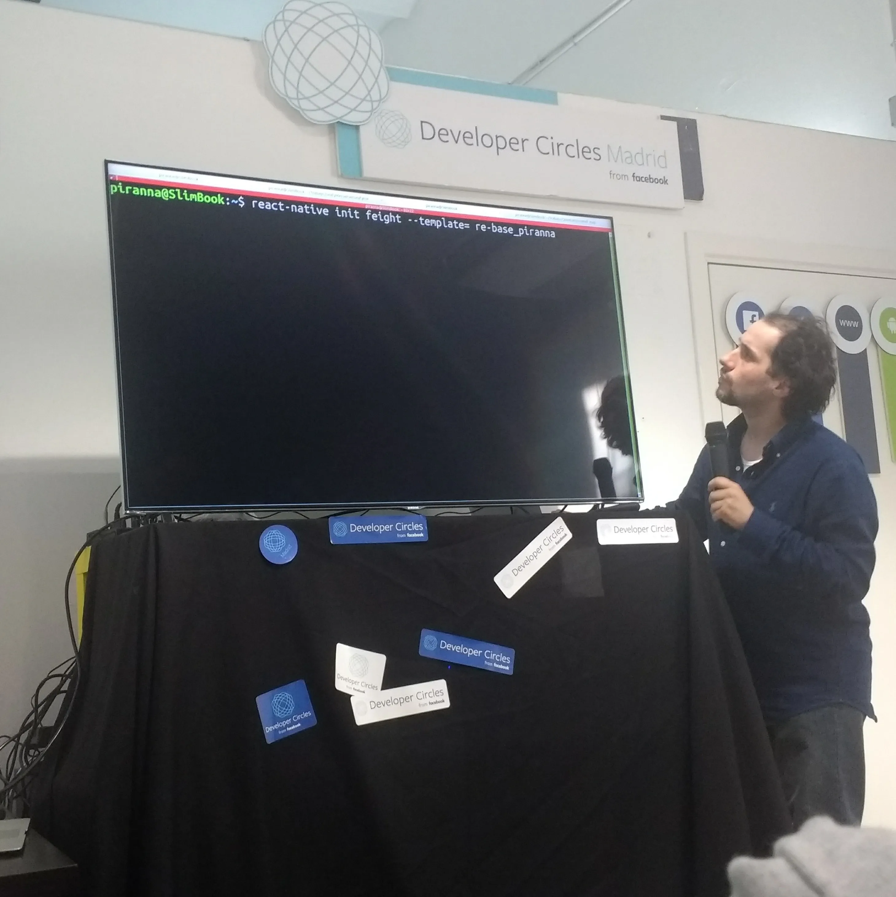

Most important contributions to third-party Open Source projects.

## [browserslist]()

features

## [istanbul-js](https://istanbul.js.org/)

`istanbul-js` is a code coverage tool used internally by the
[Jest](https://jestjs.io/) testing framework, developed by Facebook, and the
current de-facto standard for Node.js, React, and JavaScript projects. Its
default text output format was too limited when showing uncovered lines, so I
refactored it to reduce the number of decoration
characters and auto-adjust to the width of the terminal by default, in addition
to [grouping ranges](https://github.com/istanbuljs/istanbuljs/pull/525) of
consecutive missing lines to be able to show more of them.

## [libWebrtc](https://webrtc.googlesource.com/src/)

Google's implementation of the WebRTC spec, used in Chrome and Android,
among others. Here, I added support for the `removeTrack` event in the
[Java bindings](https://webrtc.googlesource.com/src/+/ffbfba979f9d48176c7ed5dcc60b6a8076303b71),
to allow dynamic removal of video and audio tracks from PeerConnection objects
in Android applications.

This contribution was sponsored by
[Atos Research & Innovation](https://atos.net/en/about-us/innovation-and-research).

## [node.js]()

static builds
test

## [node-canvas](https://github.com/Automattic/node-canvas)

As part of the development of [NodeOS](projects#NodeOS), to provide it with some
basic graphics capabilities, I added support for configurable backends in
`node-canvas`, with the intention of being able to draw directly on the Linux
`FbDev` framebuffer device instead of just only in memory, in addition to X11
and Windows GDI (Win32 API). Backend support has already been accepted in the
upstream code, while the FbDev, X11, and Win32 implementations are still pending approval. In
the future, I plan to add support for other graphic systems like accelerated
Linux DRM/KMS or macOS Quartz.

This work was later sponsored by [Ventrata](https://ventrata.com/) to improve
the FbDev backend by adding support for double-buffering, VSync, and 24-bit
color mode, and by easing the path to add new *screen-based* backends.

## [node-webrtc](https://github.com/node-webrtc/node-webrtc)

As a WebRTC pioneer since 2012 with [ShareIt!](projects#ShareIt), I've been
contributing to other projects, especially using `node-webrtc` as a building
block for Node.js applications, where I've worked on improving API
compatibility with browsers in addition to maintenance tasks.

## [num2words](https://pypi.org/project/num2words/)

`num2words` is a Python library that provides word captions of numerals for
multiple languages and dialects. As part of my work at
[qvantel](https://qvantel.com/), I not only added support for Algerian French
(where numerals are based on increments of 100, instead of increments of 20 as
spoken in France), but also added support for its coin system. I also
refactored the generic French implementation to simplify it and make it easier
to add support for other dialects like Swiss French. That work earned me
compliments both from the library owner and from my superiors for how clean and
streamlined the implementation became.

## [redux-offline](https://github.com/redux-offline/redux-offline)

`redux-offline` provides helper functions to work with network requests in the
[redux](https://redux.js.org/) state container. I have been using
it in almost all my *React Native* projects, and my contributions includes
support for async dispatching to control when failed requests are due to expired
tokens (and being able to renew them and redo the request without losing the
session), as well as support for multiple queues of parallel network operations
with different protocols in a single application, without blocks between them.
Thanks to these changes, I was given administrative permissions on the
project itself.

You can find more info about `redux-offline` in
[Redux-offline in Node.js](../_posts/2020-02-24-Redux-offline-in-Node.js.md)

## [re-start](https://github.com/react-everywhere/re-start) (AKA *ReactNative Everywhere*)

`re-start` is a wrapper for *React Native* that provides configuration to add
support for `web` platform in addition to standard Android and iOS platforms,
all of them by using a single code base. I added support for Electron and
Windows. Thanks to that, I became an administrator of the project, and future
plans include adding support for macOS applications, and reworking the project
from a *React Native* template into a CLI tool capable of enabling support for
additional platforms in any existing *React Native* project.

You can find more info about `re-start` in
[What's re-start?](../_posts/2020-04-15-Whats-re-start.md)

[React Native Spain @ F8 Madrid](https://www.meetup.com/es-ES/react-native-spain/events/250280501/),
Madrid 3rd May 2018:

