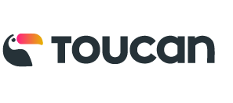

If you like the kind of projects and technologies I've been working on, I'm
available for hiring. I'm mainly interested on remote freelance projects (both
short and long term), but sometimes I'm open to considerate employee positions
or to do onsite projects, if both the tasks and the offer are interesting, and
we can negotiate the terms and conditions. You can get more info about my past
work experience in my [LinkedIn profile](https://www.linkedin.com/in/piranna/)
or in my [Curriculum Vitae](../Leganes-Combarro_Jesus_resume.pdf).

## My ideal job (AKA *Santa's letter*)

### How could it be?

- Company has something that makes it different from the other ones, and make it
  not to be "just another one". It can be anything, like a really interesting
  and unique project, exceptional perks, being a boost in my career, incentivate
  workers initiative and personal side projects, a lot of paid holidays, being
  able to work with a known and prestigious person and learn from him... Any
  thing that, if having several alternatives with equal conditions, could make
  me choice to join that company instead of any of the others ones.
- Makes a difference, both for my career and to make the world a better place.
- A responsability position with decision on projects and company future, and
  with real posibilities to improve both of them, also in ways not directly job
  related but also oriented to work conditions and the company itself.
- Travel frequently. I'm a *travel junkie*, so although I understand the
  concerns of others, for me it's a plus, so the more the merrier. If it's for
  assistance to conferences, double score :-)

By the way, this points are a common factor of *the big guys*, like Google,
Apple, Microsoft, Amazon... Salaries, laboral conditions, prestige and the kind
of projects they work with, give them instant VIP status and a *fast past* in my
priorities list, but you can get in it too if your offer seems to me as
interesting as theirs (or you are able to sell me really well your best points
and what makes your company different to others and why working on your company
is a true once-in-a-lifetime opportunity).

### What could it have or provide me?

- Interesting, creative and stimulating projects, allowing me to learn about new
  skills, technologies or knowledge areas that can be of my interests (not
  necesarily just only related to computer engineering).
- Research & Development projects, specially in academic contexts. Jobs with
  **real** posibilities of publishing academic papers will **always** be of my
  interest and have priority over others than don't.
- Incentivate workers to improve themselves and achieve technical excelence.
  This includes (but not only just sticks to) that the company fulfills the
  [Joel's test](https://www.joelonsoftware.com/2000/08/09/the-joel-test-12-steps-to-better-code/)
- All company code and intellectual property (at least the one not directly
  related with the company's bussines model) is published as Open Source and/or
  as Creative Commons.
- 100% remote positions with flexible schedule and management based on
  [async communications](https://doist.com/blog/asynchronous-communication/),
  with clear specificacions, roadmap and requirements. This does not exclude of
  having face-to-face meetings, but according to my experience, anything beyond
  a 10% of the time (one day each two weeks) for a hands-on meeting or for team
  building purposses, can be solved more efectively in a remote way.
- Travel expenses and fully paid accomodation during all my relocation time, no
  matter how long is it.
- Bonuses and beneficts directly acountable to both my own performance and the
  company one.
- Acknowledge of my involvement in the company (including voluntary overtime),
  being this in both short term beneficts and revenues (bonuses, extra paid
  holidays, travels for leisure or bussines, technological equipment...) and
  long term ones (additional shares or equity).

## Main expertise areas

- Projects auditories
  - Project structure and code quality
  - Development best practices
- Open Source and Open Standards evangelization
- Systems programming
- Software & systems architecture
- Expertise consulting
- Technical leadership and guidelines
- Design of high performance systems
- Design of clean and minimal specifications, protocols and APIs, with special
  attention to details, corner cases and not-so-common use cases
- Backend & full-stack web development
- Frontend web development & web APIs
- Mobile multi-platform apps (React Native, PWAs)

And more specially, *to do what any others can't* :-)

In detail info about my knowledge areas and experience can be found in the
[uses](uses.md) page.

### Other areas I'm interested to work with

- Research & Development, high-edge technologies and new specifications
- Operating systems design
- Filesystems design
- WebAssembly
- WebRTC
- Drivers development

### Areas willing to improve or learn

- Robotics
- FPGAs and/or hardware design
- Rust programming language related projects
- Unsupervised machine learning
- Natural Language Programing
- Quantum computing

## Open Source professional collaborations

- 
- 

Additionally, I've been contracted to work in the design and development of some
Open Source projects for the next companies:

- 
- 
- 
- 

## Private collaborations

- 
- 
- 
- 
- 
- 

## Interviews FAQs

Interesting or habitual questions I've been asked during job interviews, or when
negotiating with clients to work on a freelance project.

  
Expand

### 👨 Personal questions

#### Why should I hire you? What makes you different from other candidates?

Computers engineering has been my vocation since I was 14 years old, and since
then I've been involved with computers in a lot of aspects, like being one of
the most active member of MadridWireless and AlcorcónWireless citizen wireless
groups or [Madrid Macintosh Users Group](http://gumcam.org), or being one of the
founder member of [Robotic and Domotic Spain Association](https://www.arde.cc).
I've been working as computers programmer professionally since 17 years old, and
also being involved in Open Source communities since then. I love puzzles and
anything that can be an intellectual challenge to me (that's one of the reasons
I started to learn chinese), and for me programing is like a sort of creative
jigsaw. Due to that, I've been involved in the development of more than 300 Open
Source projects, some of them awarded in national championships, and also I've
being invited to do keynotes and stand-up at several national conferences, and
I'm proud to say that I have been able to work all my life in my true passion.

My background has provided me a lot of experience and knowledge in almost all
computers engineering areas, both professionally or in side projects, so I can
be able to understand the implications of each decision at several levels. I
love high edge technology and to know how everything works and what's able to
do. This gives me a tendency to put technology on its limits, sometimes
unconsciosly and anothers on purposse, by using the code or service beyond the
developer original intention, but also to find and use the most concise,
specific and idiomatic way of doing the things by using any available feature or
design decision that can help to write a clean and maintenable code, that
usually leads me to find bugs and usage corner cases. That also has lead myself
to put high attention on code quality and to develop simple and minimal APIs in
all the code I develop, and to enforce that high quality standards on others.

#### What are your hobbies outside of work?

Besides working on my own research side projects, I like running, travelling,
diner out, visit museums, going to cinema or reading, between others.

#### What's your opinion about code tests?

I have a "no code tests" policy, it's time I can't dedicate to my freelance
projects nor my friends, family or hobbies. I have more than 10 years of Open
Source code published in my [Github account](https://github.com/piranna), that
clearly show my capabilities and code quality standards. If you *still* consider
that's not enought and need an actual code test, you can contract me for some
hours both to complete the code test or to do an actual task in your code base,
so you can evaluate my work on first hand.

By the way, *big guys* like Google, Apple, Microsoft, IBM, Amazon, Ebay...
**don't** do code tests, or they are short ones like *katas* to know about your
reasoning, but instead they do in-site technical interviews instead. It's true
their selection processes are long and tyring and you need to prepare yourself
for them in advance, but not only their job conditions, salaries and prestige
compensate that effort, but also they usually pay flight tickets and hotel rooms
just so devs can be able to go to their offices and interview them. They *value*
their candidates time, and invest in them, so don't be more *picky* than they
and show that you are truly interested in your candidates too.

#### Are you available to relocate?

I prefer (almost) fully remote positions, or if not, job positions located in
Madrid, Spain (both downtown or MetroSur area), but I'm also available for
relocation. If that's mandatory, I have only three conditions:

1. salary / daily rate needs to be at least the same I would earn by working on
   Madrid or fully on remote, plus a proportional increment if destination city
   live level is higher than Madrid.
2. company needs to provide me accomodation, or pay me a suplement for the flat
   rental and give me any warrants or help I would need to rent it by myself
3. company provides me flight tickets for both joining and leaving the company,
   and to go home and back at least twice a year (one of them for Christmas).

On the other hand, I'm a *travel junkie*, so if it's a remote position but the
job requires me to travel, I consider this a plus and the best of both worlds
:-)

### 💻 Technology

#### What's your favorite tech stack?

I don't have a fixed one and I'm flexible with the technology to be used, it
mostly depends on what one does the best fit for each project, but in general
terms, depending of what's the project scope and in order of preference, my
favorites ones are:

- **Low level**: [Rust](https://www.rust-lang.org/) or `C/C++`
- **High level**: [Node.js](https://nodejs.org) or
  [Python](https://www.python.org/), depending on the priority on each poject
  about IO performance or code readibility. I also **love** to use high level
  languages for non-critical low level programming when possible, like
  [filesystems](projects.md#pirannafs), hardware drivers, automation, building
  tools... or, why not, full [operating systems](projects.md#nodeos) :-) At this
  moment I'm also considering `Rust` as an interesting alternative too.
- **UI**: CLI and terminal tools, web-based technologies, or ReactNative
- **web frameworks**:
  - **backend**: [JAMstack](https://jamstack.org/),
    [fastify](https://www.fastify.io/), [Django](https://www.djangoproject.com/)
    or [Twisted](https://twistedmatrix.com/). It also depends of the fit of
    technology to each project, or availability of resources, allowed time or
    off-the-shelves libraries
  - **frontend**: [React Native](https://reactnative.dev/) (both for portable
  mobile aps and [web](https://github.com/necolas/react-native-web)),
  [React](https://es.reactjs.org/), and for performance and code compatibility
  with desktop and server, combined with `Rust` compiled to
  [WebAssembly](https://webassembly.org/)

#### Are you interested in learning new technologies? Which ones and why?

At this moment I'm learning about Machine Learning and AI, where I'm more
interested in Natural Language Programming and Understandable Neural Networks,
and I'm improving my skills with Rust programming language. I'm also interested
on learning about Quantum Computing, and recently I self-teached about Verilog
HDL and hardware design. I'm a hands-on learner and a bit obssesed with
technical details, so if I get some interesting project between my hands or find
something that I think can be fixed or improved, I don't have problems learning
new skills or knowledge that can be useful to me to do it, specially if they are
stablished and future-proof industrial standards and not just some temporally
fashioned or hyped libraries and frameworks.

### 🏆 Achievements

#### What's the technical challenge you are most proud of?

I've designed and developed my own Operating System [NodeOS](projects.md#nodeos)
with more than 6000 stargazers on Github and winner of national Universitary
Free Software Championship. It was also my bachelor thesis, graduated with
distinction.

You can find more info about this and other projects I've worked on and that I'm
proud of, both mine or from others, in the [projects](projects.md) page.

#### Could you share some numbers about the projects you've worked on? e.g.: users, requests, downloads, etc

- NodeOS has more than 6000 stargazers on Github
- Published more than 175 packages in [npm](https://www.npmjs.com/~piranna)
- 3 times winner of [CUSL](https://www.concursosoftwarelibre.org/), spanish
  national Universitary Free Software Championship (PirannaFS, ShareIt! and
  NodeOS)
- Worked on two adquired start-ups (Kurento and lingbe)
- Referenced in the book
  [HTML5 for Masterminds](http://www.formasterminds.com/html5_for_masterminds_3rd_edition/)
  by J.D. Gauchat due to my pioneer work on WebRTC with
  [DataChannels-polyfill](https://github.com/ShareIt-project/DataChannel-polyfill)

### 🏢 Company culture

#### What types of companies have you worked in? e.g.: startups, consulting, enterprise, agencies, etc

I've worked for some stablished enterprises like
[Telefónica](https://www.telefonica.com), and a couple of times for consulting
firms or at freelance agencies, but the ones I've worked more times and enojed
the most has been as freelance projects on my own and on startups, some of them
later adquired by bigger companies like [Kurento](https://www.kurento.org/)
(adquired by [Twilio](https://www.twilio.com/)) or [lingbe](https://lingbe.com/)
(adquired by [italki](https://www.italki.com/)).

#### What type of company would you like to work for and why?

I like to work on startup companies, or in a startup-like minded team, since
they are the most creative and dynamic ones. I would like to work on research &
development or on a company that has its own product, and a company that's
mostly focused on the quality of their product over any other aspect, instead of
being directed by sales or any predefined deadlines.

In short: I want to work on an engineering company, not just a technological
one.

#### What do you look for in a company or project?

- Engineering companies, not technology ones.
- Innovation, design of new technologies, and usage and development of open and
  standard specifications. I totally identify myself with the motto of my
  *alma mater*, the [Rey Juan Carlos University](https://www.urjc.es/):
  *non nova, sed nove* ("not a new one, but in a new way").

In a similar way, I consider myself a practical person but with ethical
principles, and hope the ones of clients and companies I work with are aligned
to mines:

- "*Make money*" is **not** one of the company main priorities (both directly or
  indirectly), nor it's of their clients, or at least it's not the main purposse
  of the project I'm going to work with. I work mostly for the project and the
  technology themselves and what I can learn from them, not for their revenues.
  Acording to my *ethos*, money and beneficts must always be a collateral effect
  of work and a medium to achieve experiences, not a main objective by itself.
- If *money* is a direct or indirect core concept of the project up to the point
  that removing it makes the project pointless, probably I would not be so much
  interested on working on it if there's no other elements like the technologies
  being used or the project concept or the oportunities that it can provide me,
  but definitely not by the project itself alone.

#### Do you prefer to work alone, or as part of a group?

I like to work in a group, specially on small ones focused on a single project
where there's a clear roadmap on what to do, or where technical expertise of
co-workers is high and everybody is trying to do their best. This open the door
to the posibility of discuss the different approachs to the problems and learn
ones from the others. In the same way, when I have a lead or expert role, I
like to surround me of co-workers with good technical skils so I can take in
account their points of view too when defining the project architecture, the
development guidelines or the project quality bar that other have to follow. In
other cases where that's not possible, I usualy like to work as part of a group
where people can be focused each one on an area of the code that they can master
and know in detail and manage it on their own, so everybody can be able to focus
on their knowledge area.

#### What do you value the most about a team?

- Team members are motivated, distressed, and working together for the same goal
- Everybody is focused trying to achieve technical excellence, and doing their
  best instead of doing it fast
- Co-workers are technically as good as me or better, so I can be able to learn
  from them, or they have initiative and are eager to learn and improve
  themselves

#### Do you currently have a job? What do you like and dislike about it?

Currently I'm working as *Tech Lead Backend* and *DevOps* for
[BotXO](https://www.botxo.ai/) as my main job, and I'm activelly looking for a
project to work on remote as freelancer in my spare time (maybe yours! :-D ).

##### 👍 Likes

- walking distance from my home
- lots of schedule flexibility
- reduced day all the year
- over average payment
- interesting technological area (chatbots)

##### 👎 Dislikes

- legacy code and design decissions, and almost no time sloted to fix them
- architecture complex and very cohexionated, with lots of inter-dependencies
  between projects

#### What would motivate you to change job?

1. The most important, an interesting project that caught my attention and
   motivates me to do the change by itself, no matter any other things like
   salary, relocation or social beneficts. This can be the project topic,
   technologies being used, the profesional or academic career oportunities that
   it can offer me...
2. A salary according to my expectations.
3. Quantity and quality of social beneficts provided in addition to the salary,
   specially restaurant card, public transport card, gym subscription, remote
   work, flexible schedule...

#### What would motivate you to join a new project?

- Higher salary maintaining or improving all my perks and social beneficts
- Work on a research project, ideally somewhat related to own research areas
- Position with responsability that could help me to improve my career both
  profesional and academically, with publishing of papers

#### What you are looking for in your next job?

A project I can feel my own and get involved on it, helping to define its shape.
Also a project that can make me proud of and help to learn new things and
improve my career, ideally both profesionally and in academic areas.

#### If I made you an offer, what would make you to reject it?

If we get up to this point, probably I would have already consider the pros &
cons regarding changing my current job, so only I would reject a job offer if
the tasks I would be involved are not motivating enought, or the final salary
difference with my current job would not compensate the change (this includes
the case when relocation is required and it makes me a drop in my buying level
and/or life quality), so it's better that we discuss these topics in the first
interview.

